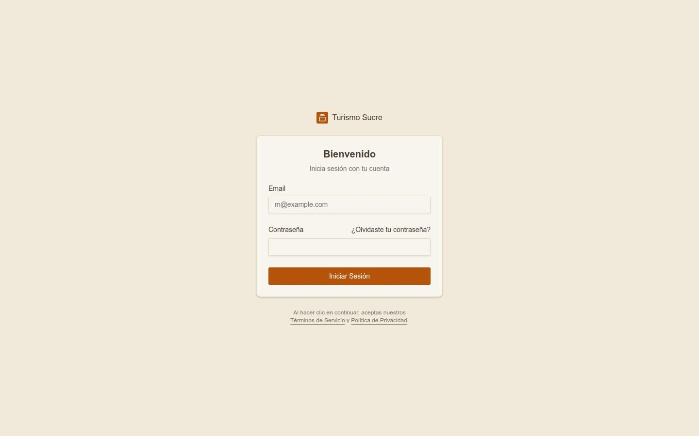
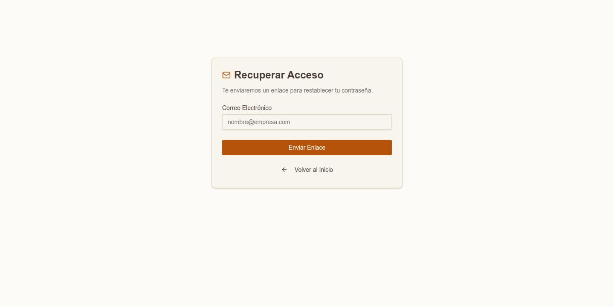
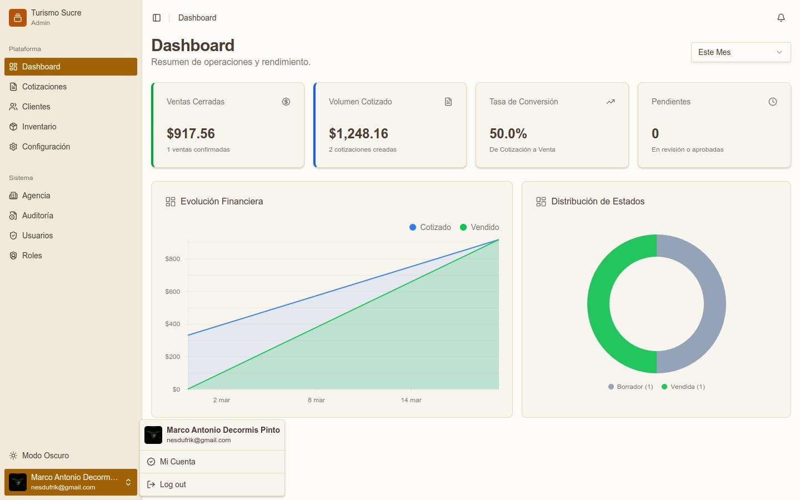
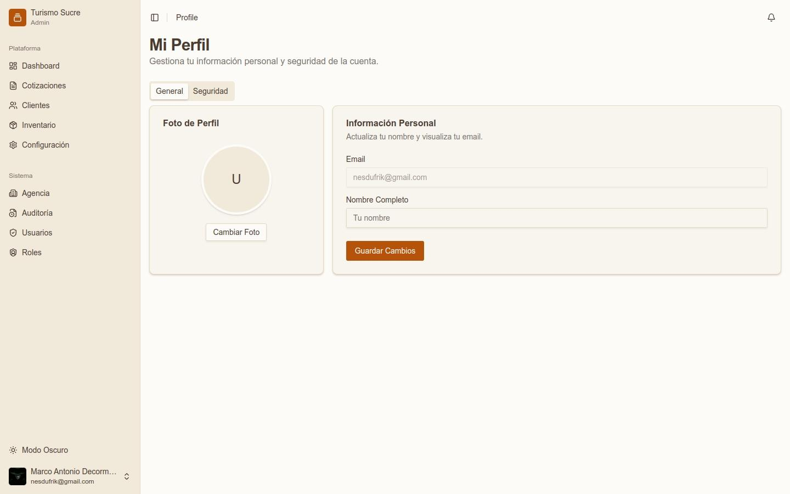
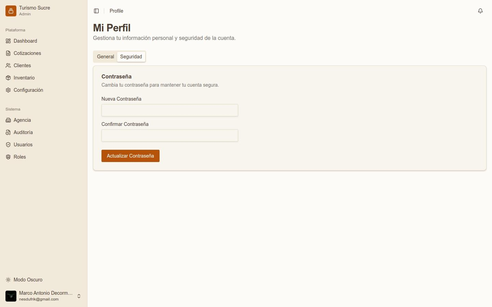

## Inicio de Sesión

*Pantalla de inicio de sesión*

<ol><li>Abra su navegador web e ingrese la URL del sistema.</li><li>Complete el campo Email con su correo electrónico registrado.</li><li>Ingrese su Contraseña.</li><li>Haga clic en Iniciar Sesión.</li></ol>

:::note
Si su cuenta fue creada mediante invitación, debe completar el registro siguiendo el enlace recibido en su correo antes de poder iniciar sesión por primera vez.
:::

## Recuperar Contraseña

*Pantalla de recuperación de contraseña*

<ol><li>En la pantalla de login, haga clic en &iquest;Olvidaste tu contraseña?</li><li>Ingrese su Correo Electrónico y haga clic en Enviar Enlace.</li><li>Revise su bandeja de entrada y siga las instrucciones del correo recibido.</li></ol>

## Menú de Usuario y Cierre de Sesión

*Menú de usuario en la esquina inferior izquierda*

En la esquina inferior izquierda aparece su nombre y correo. Al hacer clic se despliegan las opciones:

<ul><li>Mi Cuenta: accede a la configuración de su perfil personal.</li><li>Log out: cierra la sesión activa de forma segura.</li></ul>

## Mi Perfil

### Pestaña General — Información Personal

*Perfil del usuario — pestaña General*
<table class="manual-table"><tr><td>

**Campo / Elemento**
</td><td>

**Descripción**
</td></tr><tr><td>

**Foto de Perfil**
</td><td>

Permite subir o cambiar la foto del usuario con el botón Cambiar Foto.
</td></tr><tr><td>

**Email**
</td><td>

Muestra el correo electrónico registrado (no editable).
</td></tr><tr><td>

**Nombre Completo**
</td><td>

Campo editable para actualizar su nombre visible en el sistema.
</td></tr><tr><td>

**Guardar Cambios**
</td><td>

Botón para confirmar las modificaciones.
</td></tr></table>

### Pestaña Seguridad — Cambio de Contraseña

*Perfil del usuario — pestaña Seguridad*
<table class="manual-table"><tr><td>

**Campo / Elemento**
</td><td>

**Descripción**
</td></tr><tr><td>

**Nueva Contraseña**
</td><td>

Ingrese la nueva contraseña deseada.
</td></tr><tr><td>

**Confirmar Contraseña**
</td><td>

Repita la nueva contraseña para verificación.
</td></tr><tr><td>

**Actualizar Contraseña**
</td><td>

Botón para guardar el cambio.
</td></tr></table>
