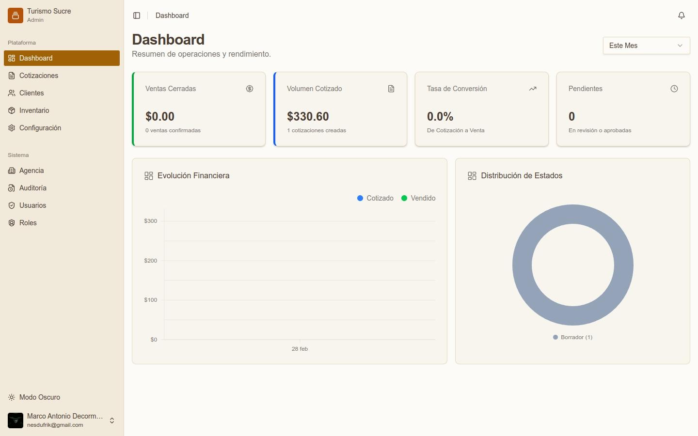
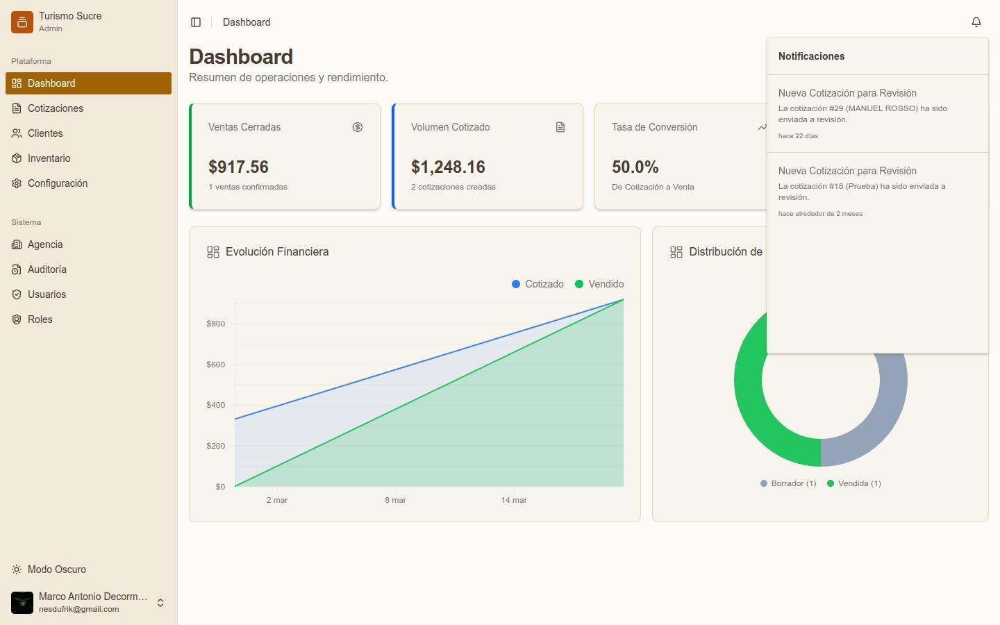

El Dashboard es la pantalla principal del sistema. Muestra un resumen en tiempo real de las operaciones y el rendimiento de la agencia para el período seleccionado.

*Dashboard — vista general*

## Indicadores Principales (KPIs)

<table class="manual-table"><tr><td>

**Campo / Elemento**
</td><td>

**Descripción**
</td></tr><tr><td>

**Ventas Cerradas**
</td><td>

Monto total en USD de cotizaciones confirmadas como Vendidas en el período.
</td></tr><tr><td>

**Volumen Cotizado**
</td><td>

Monto total de todas las cotizaciones generadas en el período.
</td></tr><tr><td>

**Tasa de Conversión**
</td><td>

Porcentaje de cotizaciones que pasaron a estado Vendida respecto al total cotizado.
</td></tr><tr><td>

**Pendientes**
</td><td>

Cantidad de cotizaciones en estado En Revisión o Aprobada.
</td></tr></table>

## Gráficos

<ul><li>Evolución Financiera: gráfico de área que muestra la curva de montos cotizados (azul) versus vendidos (verde) a lo largo del tiempo.</li><li>Distribución de Estados: gráfico de anillo que muestra la proporción de cotizaciones por estado (Borrador, Aprobada, Vendida).</li></ul>

## Notificaciones

*Panel de notificaciones del sistema*

El ícono de campana (&#128276;) en la esquina superior derecha muestra las alertas del sistema. Al hacer clic se despliega un panel con eventos recientes, como nuevas cotizaciones enviadas a revisión. Cada notificación incluye un resumen y la fecha relativa del evento.

El selector Este Mes en la esquina superior derecha permite filtrar el período de visualización del dashboard.
