El módulo de Cotizaciones es el núcleo operativo del sistema. Permite crear, gestionar y hacer seguimiento de todas las propuestas de viaje enviadas a clientes y agencias.

## Lista de Cotizaciones

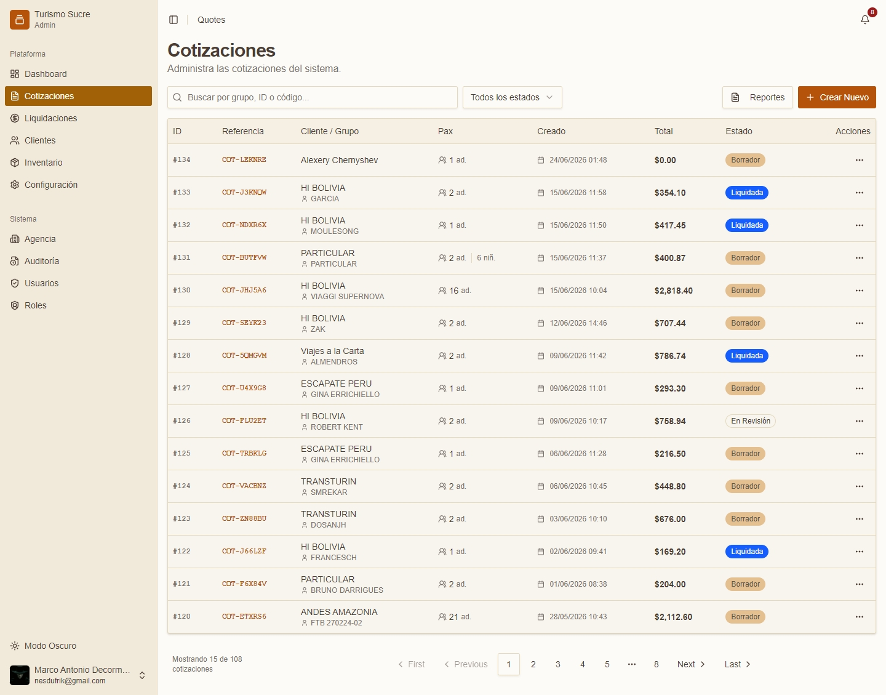

*Lista de cotizaciones con estados y filtros*

Al ingresar al módulo se muestra una tabla con todas las cotizaciones:
<table class="manual-table"><tr><td>

**Campo / Elemento**
</td><td>

**Descripción**
</td></tr><tr><td>

**ID**
</td><td>

Identificador único del registro en base de datos (ej. 32).
</td></tr><tr><td>

**Referencia**
</td><td>

Código alfanumérico único de la cotización (ej. COT-LEKNRE).
</td></tr><tr><td>

**Cliente / Grupo**
</td><td>

Nombre del cliente o agencia y el nombre del viajero/grupo.
</td></tr><tr><td>

**Pax**
</td><td>

Número de pasajeros.
</td></tr><tr><td>

**Creado**
</td><td>

Fecha de creación de la cotización.
</td></tr><tr><td>

**Total**
</td><td>

Monto total en USD.
</td></tr><tr><td>

**Estado**
</td><td>

Estado actual: Borrador, En Revisión, Liquidada o Rechazada.
</td></tr><tr><td>

**Acciones (&#8943;)**
</td><td>

Menú desplegable con opciones sobre la cotización.
</td></tr></table>

## Menú de Acciones en la Lista

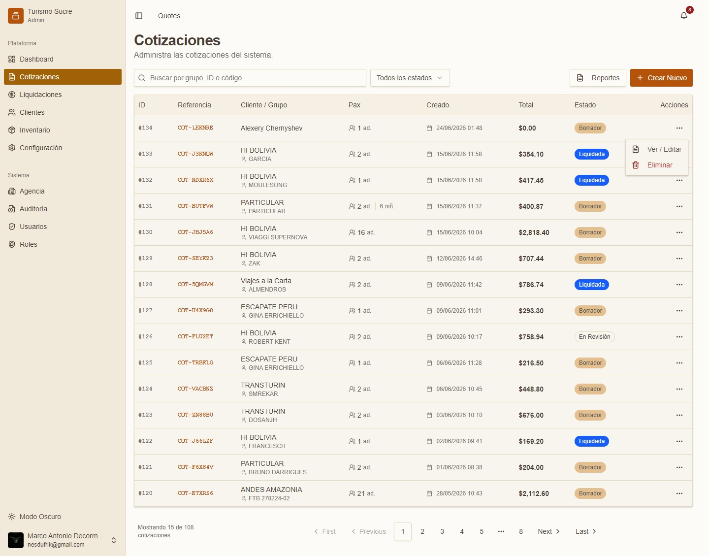

*Menú de acciones disponible por cotización*

Para editar una cotización basta con hacer clic en la fila para ingresar a verla o editarla.

Al hacer clic en el ícono &#8943; de cualquier cotización, se despliegan dos opciones:

<ul><li>Ver / Editar: abre la cotización para visualizarla o modificarla según el estado y los permisos del usuario.</li><li>Eliminar: elimina la cotización del sistema. Esta acción es permanente.</li></ul>

:::caution
Los usuarios con rol Agent solo pueden eliminar sus propias cotizaciones. Los administradores pueden eliminar cualquier cotización.
:::

## Estados de una Cotización

Cada cotización pasa por diferentes estados según el flujo de trabajo:
<table class="manual-table"><tr><td>

**Estado**
</td><td>

**Descripción y botones disponibles**
</td></tr><tr><td>

**Borrador**
</td><td>

En edición. Se puede modificar libremente. Botones: PDF, Responder*, Solicitar Revisión, Liquidar*, Guardar. (*según rol)
</td></tr><tr><td>

**En Revisión**
</td><td>

Enviada para aprobación. No editable. Botones: PDF, Rechazar*, Aprobar*, Guardar. (*solo rol con permiso quotes.approve)
</td></tr><tr><td>

**Liquidada**
</td><td>

Cotización cerrada. No editable. Botones: PDF, Responder, Reabrir para Edición (solo por administrador).
</td></tr><tr><td>

**Rechazada**
</td><td>

Cotización rechazada que tiene las mismas características que una cotización en estado Borrador. Botones: PDF, Solicitar Revisión, Guardar.
</td></tr></table>

## Crear una Nueva Cotización

Haga clic en + Nueva Cotización. La pantalla se divide en dos paneles.

### Paso 1 — Completar Datos Generales (Panel Izquierdo)

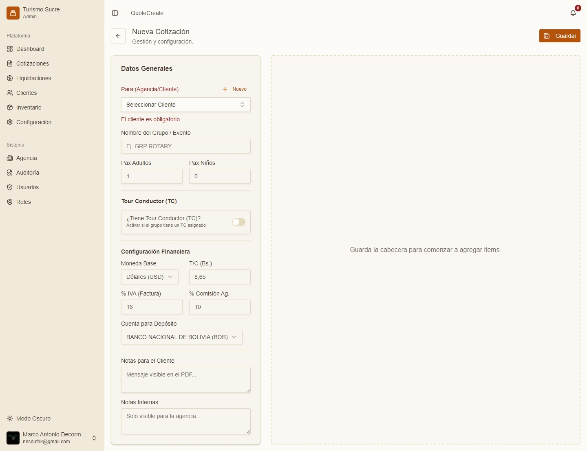

*Formulario de nueva cotización — datos generales*

<table class="manual-table"><tr><td>

**Campo / Elemento**
</td><td>

**Descripción**
</td></tr><tr><td>

**Para (Agencia/Cliente)**
</td><td>

Selector del cliente destino. Use + Nuevo para crear uno al momento si no existe.
</td></tr><tr><td>

**Nombre del Grupo / Evento**
</td><td>

Identificador del grupo de viajeros (ej. GRP ROTARY).
</td></tr><tr><td>

**Pax Adultos**
</td><td>

Número de pasajeros adultos.
</td></tr><tr><td>

**Pax Niños**
</td><td>

Número de pasajeros niños.
</td></tr><tr><td>

**Tour Conductor (TC)**
</td><td>

Si el grupo tiene Tour Conductor, marcar esta casilla para aplicar la tarifa correspondiente.
</td></tr><tr><td>

**Moneda Base**
</td><td>

Moneda de la cotización (por defecto Dólares USD).
</td></tr><tr><td>

**T/C (Bs.)**
</td><td>

Tipo de cambio USD &rarr; BOB aplicado.
</td></tr><tr><td>

**% IVA (Factura)**
</td><td>

Porcentaje de IVA para la factura (por defecto 16%).
</td></tr><tr><td>

**% Comisión Ag.**
</td><td>

Porcentaje de comisión de la agencia (por defecto 10%).
</td></tr><tr><td>

**Cuenta para Depósito**
</td><td>

Cuenta bancaria para el pago del cliente.
</td></tr><tr><td>

**Notas para el Cliente**
</td><td>

Mensaje visible en el PDF entregado al cliente.
</td></tr><tr><td>

**Notas Internas**
</td><td>

Comentarios internos, no visibles en el PDF.
</td></tr></table>

:::note
Debe hacer clic en Guardar antes de poder agregar ítems al itinerario. El sistema creará la cotización con un número asignado y habilitará el panel derecho.
:::

### Paso 2 — Agregar Ítems al Itinerario (Panel Derecho)

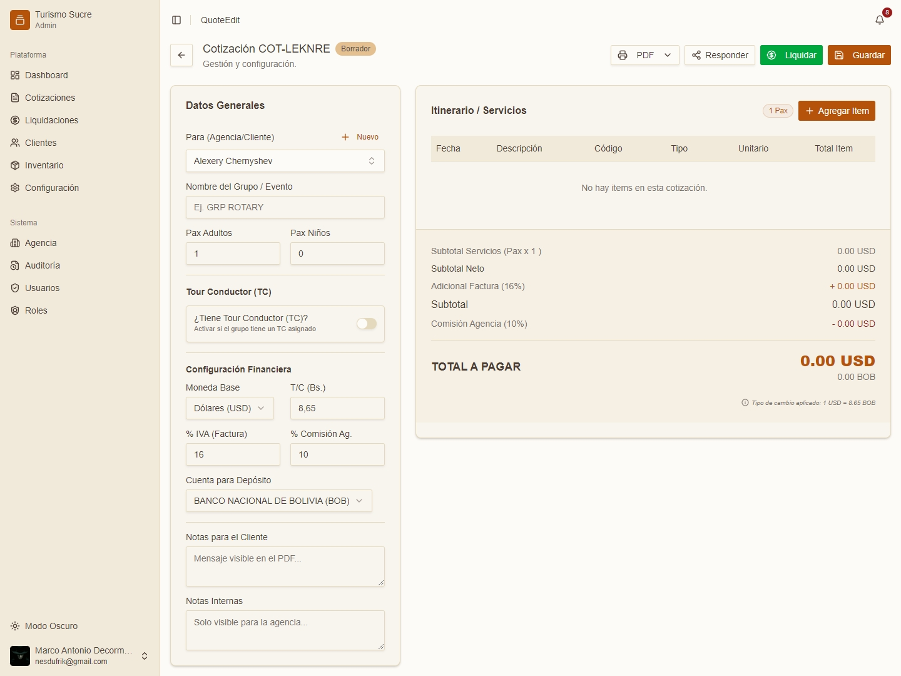

*Panel del itinerario con botón Agregar Ítem*

Una vez guardada la cabecera, haga clic en + Agregar Ítem. Se despliega un menú con tres opciones:

### Opción: Agregar Servicio / Tour

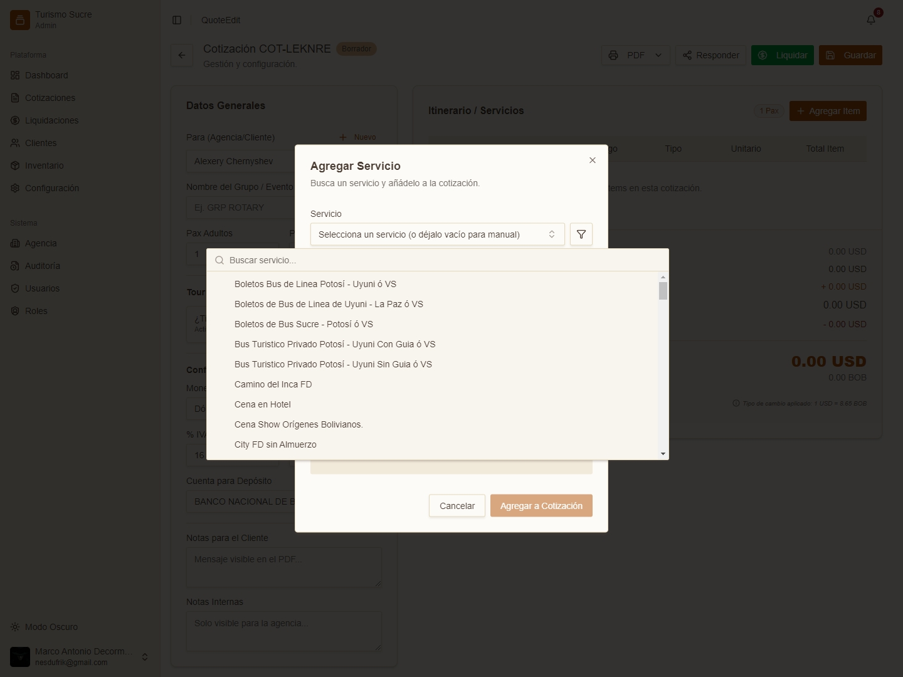

*Buscador de servicios — lista completa*

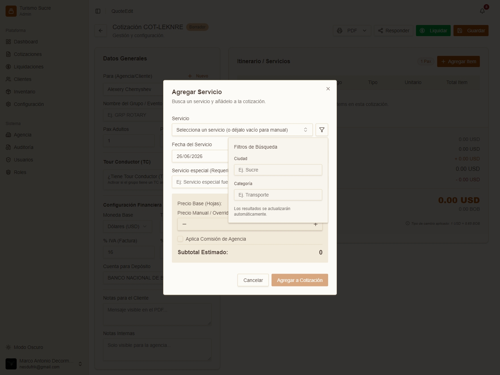

*Buscador de servicios con filtros*

El buscador de servicios permite encontrar rápidamente el servicio deseado de dos formas:

**Búsqueda por nombre:**

Escriba directamente el nombre del servicio en la barra de búsqueda. La lista se filtra en tiempo real mostrando los resultados coincidentes.

**Búsqueda por filtros:**

El sistema permite combinar criterios de categoría y ciudad para filtrar los servicios disponibles.

:::note
Puede dejar solo los filtros sin escribir un nombre y seleccionar cualquier resultado de la lista filtrada. O puede combinar filtros + nombre para mayor precisión.
:::

Una vez seleccionado el servicio, complete el formulario:

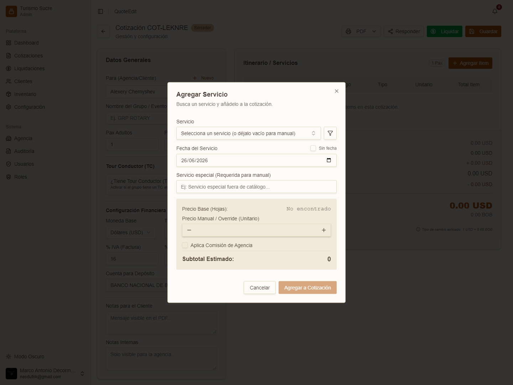

*Formulario para agregar un servicio a la cotización*
<table class="manual-table"><tr><td>

**Campo / Elemento**
</td><td>

**Descripción**
</td></tr><tr><td>

**Servicio**
</td><td>

Seleccione del catálogo o deje vacío para ingreso manual.
</td></tr><tr><td>

**Fecha del Servicio**
</td><td>

Fecha en que se prestará el servicio. Tambien se puede activar el checkbox de "Sin fecha", esto es para servicios que no tienen fecha definida.
</td></tr><tr><td>

**Servicio especial o no catalogado**
</td><td>

Si no se quiere tener un servicio en catalogo pero aun asi quiere hacer la cotización de un servicio personalizado escriba el nombre del servicio y complete el formulario. Por defecto estara marcado como Servicio Especial.
</td></tr><tr><td>

**Precio Base (Hojas)**
</td><td>

Precio calculado automáticamente según la hoja de precios y el número de Pax.
</td></tr><tr><td>

**Precio Manual / Override**
</td><td>

Permite sobrescribir el precio calculado con un valor personalizado. Esta opción tiene que ser llenada cuando el servicio es personalizado o cuando se quiere aplicar un precio especial al servicio. Si se deja este campo vacio se aplicara el precio calculado según la hoja de precios y el número de Pax.
</td></tr><tr><td>

**Aplica Comisión de Agencia**
</td><td>

Casilla para incluir o excluir este ítem del cálculo de comisión.
</td></tr><tr><td>

**Subtotal Estimado**
</td><td>

Vista previa del subtotal del ítem antes de agregar.
</td></tr></table>

### Opción: Agregar Hotel

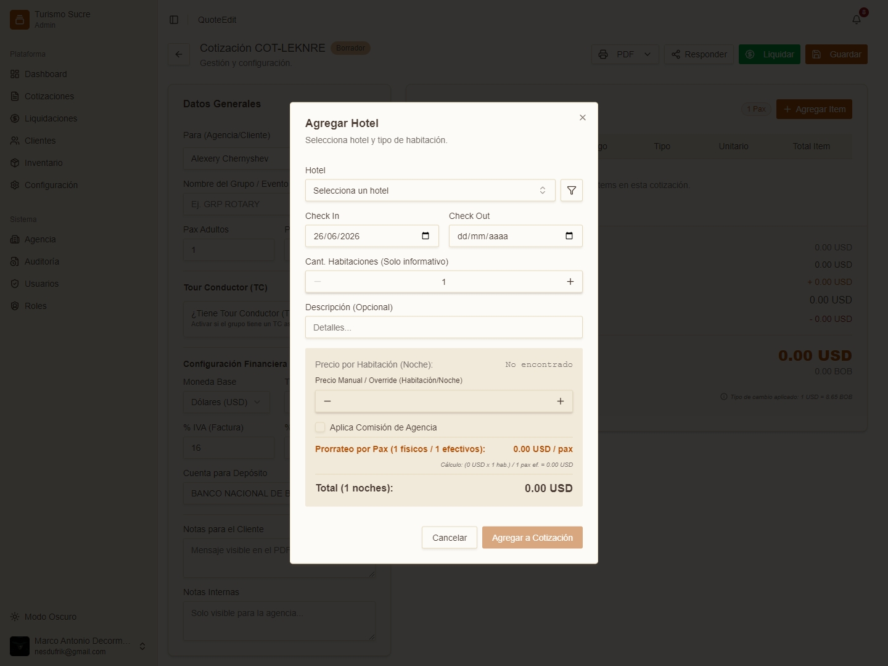

*Formulario para agregar un hotel a la cotización*

Para agregar alojamiento, seleccione Agregar Hotel y complete:
<table class="manual-table"><tr><td>

**Campo / Elemento**
</td><td>

**Descripción**
</td></tr><tr><td>

**Hotel**
</td><td>

Seleccione el hotel del catálogo. Se puede filtrar por nombre.
</td></tr><tr><td>

**Check In / Check Out**
</td><td>

Fechas de entrada y salida. El sistema calcula el número de noches automáticamente.
</td></tr><tr><td>

**Cant. Habitaciones**
</td><td>

Número de habitaciones (dato informativo para el itinerario).
</td></tr><tr><td>

**Descripción (Opcional)**
</td><td>

Detalles adicionales del alojamiento para el cliente.
</td></tr><tr><td>

**Precio por Habitación (Noche)**
</td><td>

Precio tomado del catálogo según el tipo de habitación seleccionado.
</td></tr><tr><td>

**Precio Manual / Override**
</td><td>

Permite sobrescribir el precio de la habitación.
</td></tr><tr><td>

**Prorrateo por Pax**
</td><td>

Calcula automáticamente: (precio hab. × cant. hab.) &divide; Nº Pax = costo por persona.
</td></tr><tr><td>

**Total (N noches)**
</td><td>

Total del hotel para toda la estadía.
</td></tr></table>

:::note
El prorrateo distribuye el costo total del hotel entre todos los pasajeros de la cotización. Por ejemplo: 1 habitación a $103 × 7 noches &divide; 4 pax = $180.25 por persona.
:::

### Opción: Agregar Paquete

Permite agregar un paquete turístico predefinido del inventario que combina múltiples servicios y hoteles en una sola oferta con precio integrado.

## Resumen Financiero del Itinerario

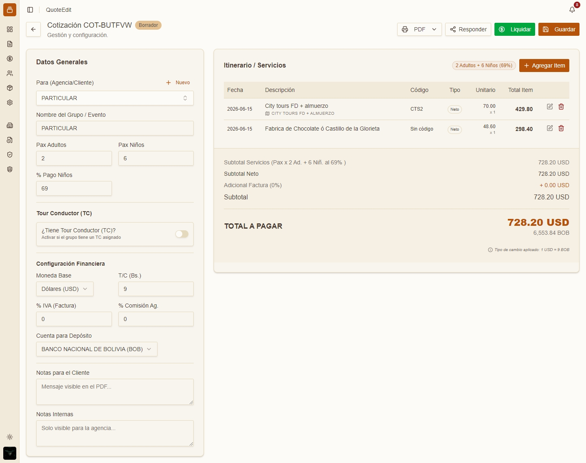

*Resumen financiero con totales calculados*
<table class="manual-table"><tr><td>

**Campo / Elemento**
</td><td>

**Descripción**
</td></tr><tr><td>

**Subtotal Servicios (Pax Ad + Pax Ni)**
</td><td>

Suma de todos los servicios y hoteles multiplicados por el número de pasajeros y agrega el porcentaje de descuento de pax niños si lo requiere.
</td></tr><tr><td>

**Subtotal Neto**
</td><td>

Suma de todos los servicios y hoteles.
</td></tr><tr><td>

**Adicional Factura (IVA%)**
</td><td>

Monto adicional por IVA (mostrado en rojo, sumado al subtotal).
</td></tr><tr><td>

**Subtotal**
</td><td>

Subtotal neto + IVA.
</td></tr><tr><td>

**Comisión Agencia (%)**
</td><td>

Monto de comisión de la agencia (mostrado en rojo negativo, se descuenta del total).
</td></tr><tr><td>

**Total a Pagar**
</td><td>

Monto final destacado en naranja, mostrado en USD y en BOB según el T/C aplicado.
</td></tr></table>

:::caution
Los usuarios con rol Agent no pueden ver los montos financieros del itinerario. En su lugar verán el mensaje: &#39;Información financiera restringida. Contacte con un administrador/supervisor para ver totales.&#39;
:::

## Vista de Cotización según Rol Agent

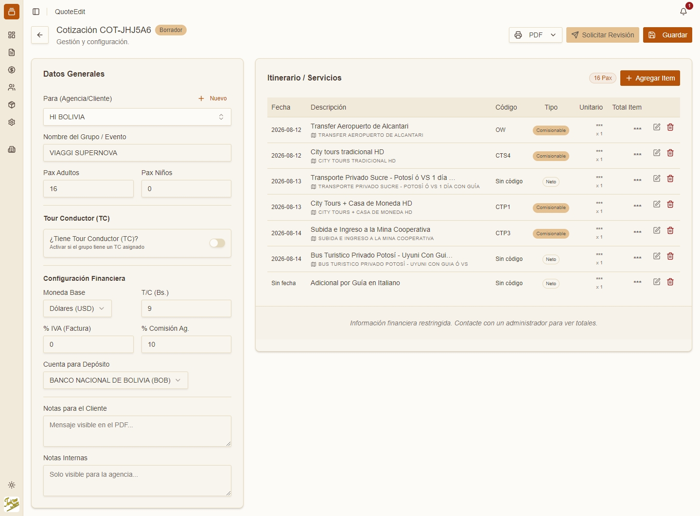

*Vista de cotización para un usuario con rol Agent*

Los usuarios con rol Agent ven una versión restringida de la cotización:

<ul><li>Pueden ver y agregar ítems al itinerario normalmente.</li><li>Los precios unitarios y totales aparecen ocultos (se muestran como &middot;&middot;&middot;).</li><li>El resumen financiero no es visible; en su lugar aparece el mensaje de información restringida.</li><li>Solo tienen acceso a los botones PDF y Solicitar Revisión.</li><li>No pueden usar el botón Responder para enviar la cotización al cliente.</li><li>En el menú del sistema, solo tienen acceso a Dashboard, Cotizaciones, Clientes e Inventario (visualización), Configuración (visualización) y Agencia en Sistema.</li></ul>

## Acciones sobre una Cotización

### Solicitar Revisión

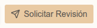

*Cotización en estado Borrador con botón Solicitar Revisión*

Cambia el estado a En Revisión y genera una notificación para los usuarios con permiso de aprobación (quotes.approve). La cotización queda bloqueada para edición.

### Liquidar / Rechazar

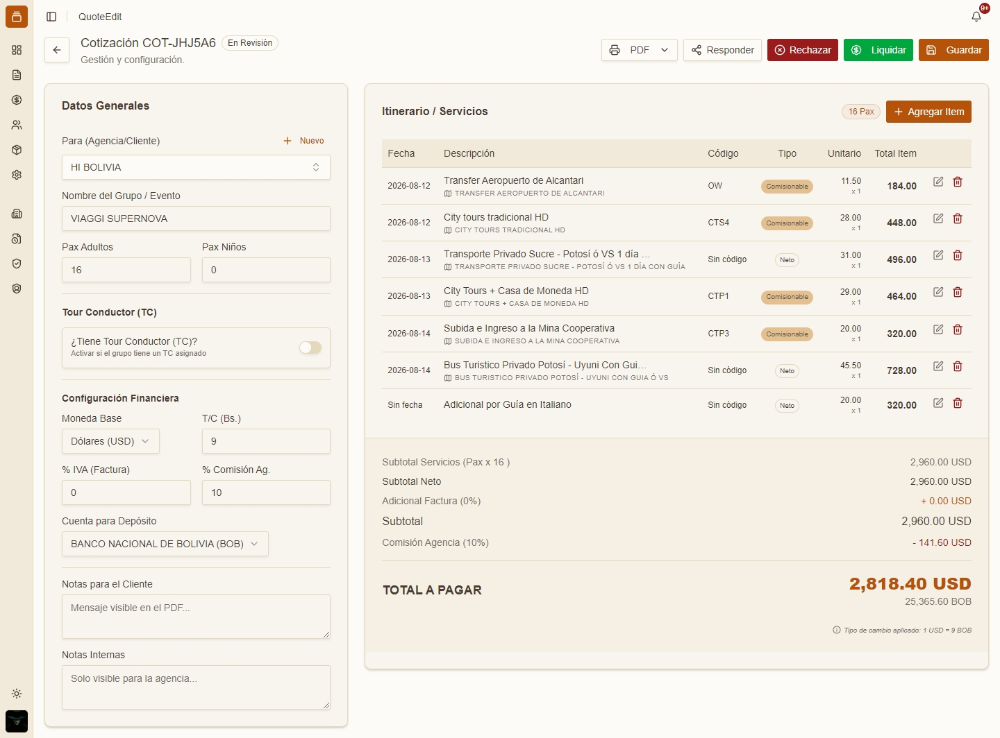

*Cotización En Revisión con botones Liquidar y Rechazar*

Disponibles solo para usuarios con el permiso quotes.approve (ej. rol Admin). Liquidar cambia el estado a liquidada. Rechazar "devuelve" la cotización a un estado Borrador para su corrección y posterior nueva solicitud de revisión. Este flujo es particular del rol de agent ya que **los roles de operations y admin pueden liquidar de manera directa sus cotizaciones**. No utilizan este estado de En Revisión.

### Responder al Solicitante

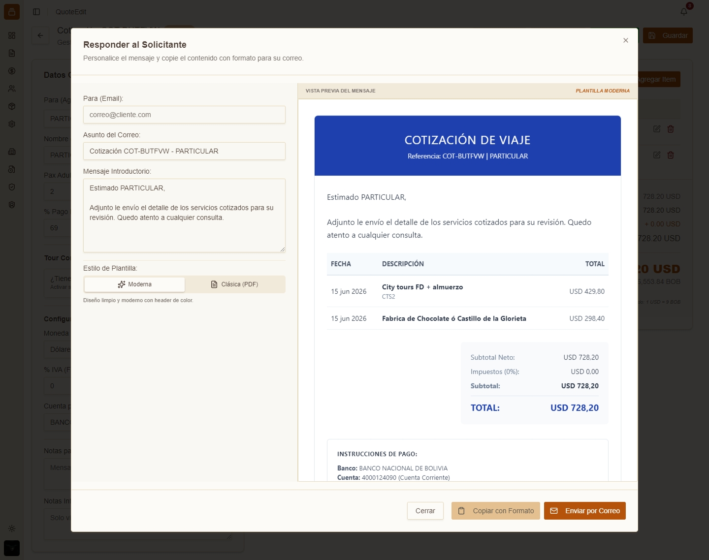

*Modal de respuesta con selección de estilo de plantilla (Moderno o Clásico).*

El botón Responder abre un panel con:

<ul><li>Campo Para (Email) se llena automaticamente si el cliente fue registrado con su correo, caso contrario llenar manualmente este campo con el correo que corresponda.</li><li>Asunto del correo prellenado (ej. Cotización #32 - Turismo Sucre).</li><li>Mensaje introductorio editable.</li><li>Vista previa del mensaje en formato HTML con el detalle completo del itinerario, totales y comisión.</li><li>Copiar con Formato: copia el contenido HTML para pegarlo en cualquier cliente de correo externo. (Gmail, Outlook, etc.)</li><li>Enviar por Correo: envía directamente desde el sistema.</li></ul>

:::caution
El botón Responder no está disponible para usuarios con rol Agent. Solo pueden generar el PDF.
:::

### Liquidar

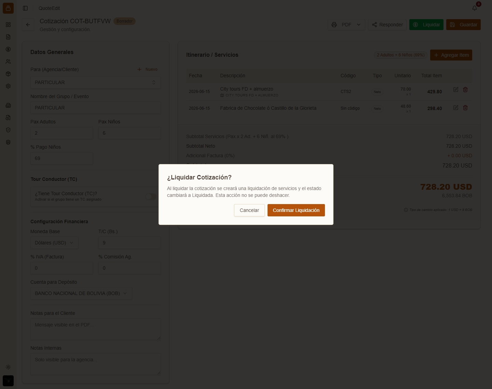

*Diálogo de confirmación para liquidar la cotización*

Esta acción solo está disponible para usuarios con el permiso quotes.liquidate (ej. rol Operations y Admin). Liquidar una cotización no implica necesariamente que se tenga que pagar, pero si implica que se genera un registro en el modulo de liquidaciones con los totales correspondientes.

La cotización se bloquea de edicion y pasa al estado Liquidada.

### Cotización Liquidada

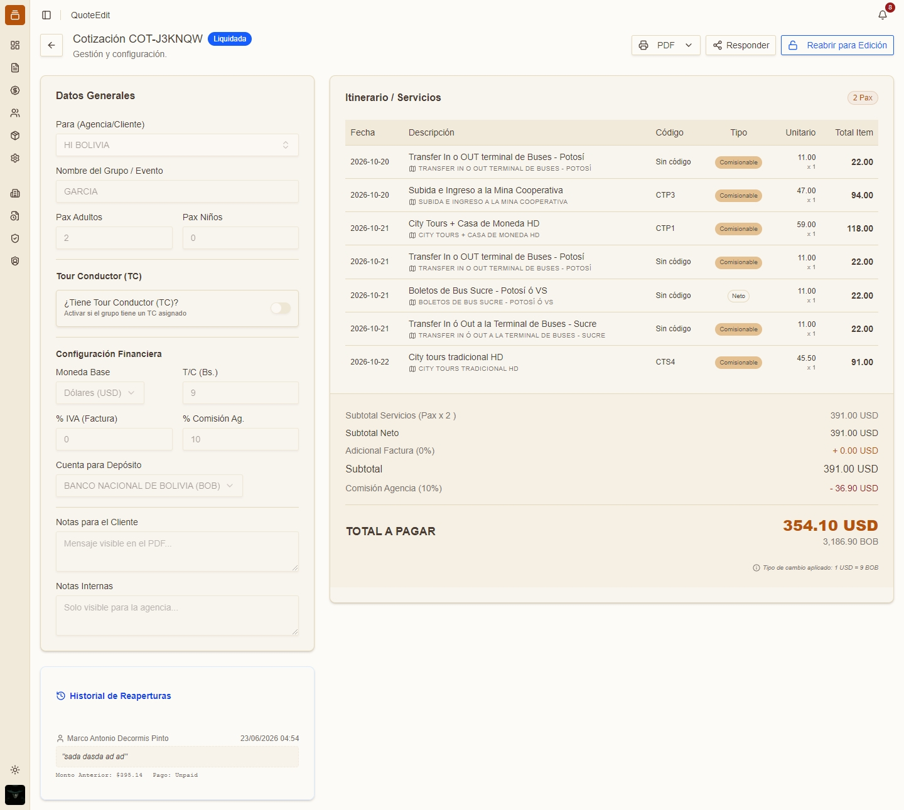

*Cotización en estado Liquidada*

Una vez liquidada la cotización, pasa al estado Liquidada y se genera un registro en el modulo de liquidaciones. Solo están disponibles los botones PDF y Responder. No se puede volver a estados anteriores con la unica excepción de que un usuario admin pueda editar la cotización liquidada y volver a liquidarla.

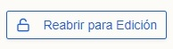

### Generar PDF

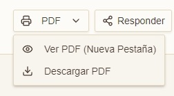

El botón PDF está disponible en todos los estados de la cotización (incluso para usuarios Agent). Genera y descarga el documento formateado con el logo de la agencia, datos del cliente, itinerario detallado y totales.
