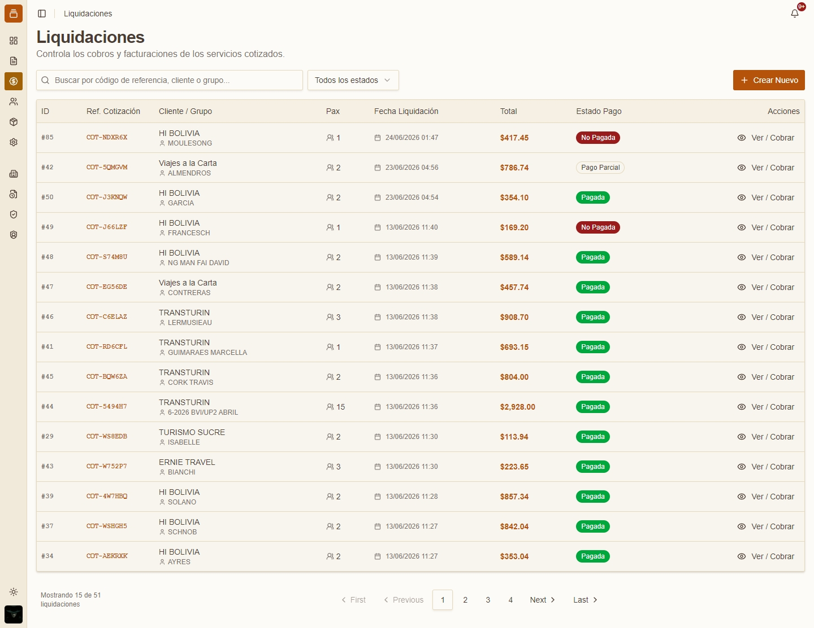
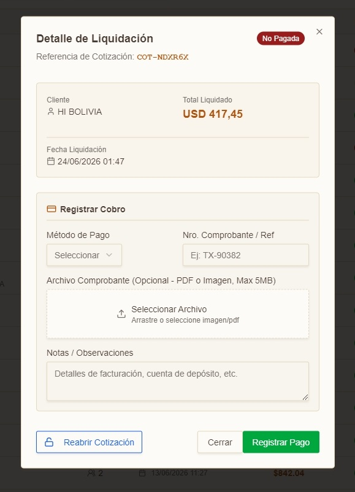
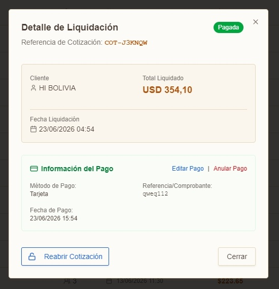
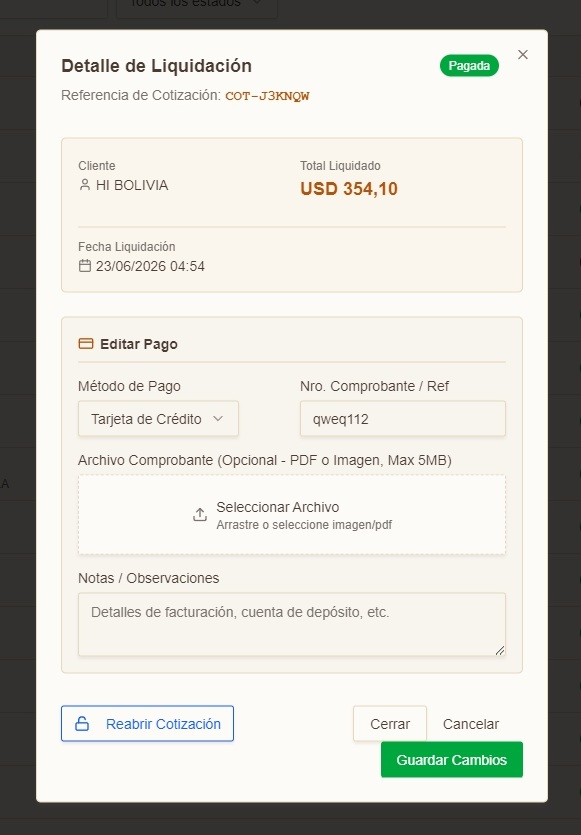
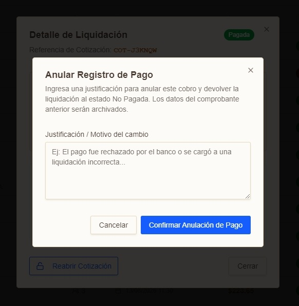
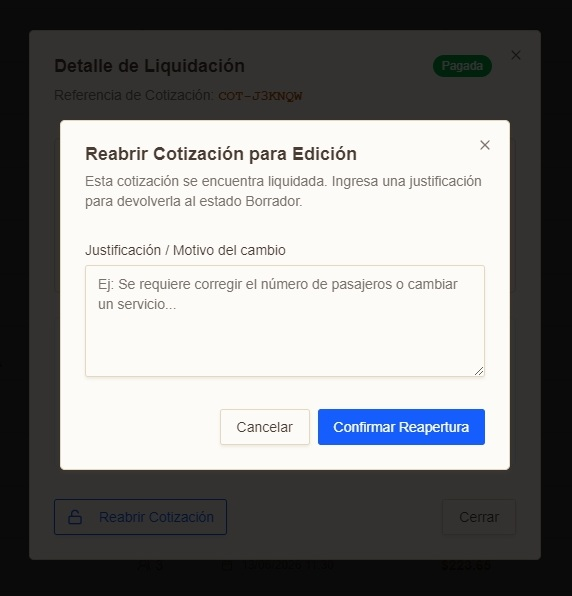

El módulo de Liquidaciones permite realizar el seguimiento y liquidación final de los viajes cotizados. 

## Lista de Liquidaciones

*Lista de liquidaciones*

Al ingresar al módulo se muestra una tabla con todas las liquidaciones:
<table class="manual-table"><tr><td>

**Campo / Elemento**
</td><td>

**Descripción**
</td></tr><tr><td>

**ID**
</td><td>

Identificador único del registro en base de datos (ej. 32).
</td></tr><tr><td>

**Ref. Cotización**
</td><td>

Referencia de la cotización generada a partir del registro en el módulo de cotizaciones.
</td></tr><tr><td>

**Cliente / Grupo**
</td><td>

Nombre del cliente o agencia y el nombre del viajero/grupo.
</td></tr><tr><td>

**Pax**
</td><td>

Número de pasajeros.
</td></tr><tr><td>

**Fecha Liquidación**
</td><td>

Fecha de liquidación de la cotización.
</td></tr><tr><td>

**Total**
</td><td>

Monto total en USD.
</td></tr><tr><td>

**Estado Pago**
</td><td>

Indica si la liquidación ha sido pagada por el cliente.
</td></tr><tr><td>

**Acciones**
</td><td>

Permite visualizar el detalle de la liquidación.
</td></tr></table>

## Ver / Cobrar

### Liquidación Sin Pagar

*Liquidación en estado "Sin Pagar"*

En esta vista se pueden observar los siguientes elementos: 
<ul><li>Cliente.</li><li>Total Liquidado.</li><li>Fecha Liquidación.</li></ul>

Y un formulario donde registramos el cobro:
<table class="manual-table"><tr><td>

**Campo / Elemento**
</td><td>

**Descripción**
</td></tr><tr><td>

**Metodo de pago**
</td><td>

El metodo de pago utilizado por el cliente. Puede ser:
<ul><li> Efectivo</li><li>Transferencia</li><li>Tarjeta</li></ul>
</td></tr><tr><td>

**Nro. Comprobante / Ref**
</td><td>

El número del comprobante de pago o referencia de la transacción.
</td></tr><tr><td>

**Archivo Comprobante**
</td><td>

El archivo del comprobante de pago es opcional. El formulario acepta PDF o Imagen, max 5MB.
</td></tr><tr><td>

**Notas / Observaciones**
</td><td>

Notas u observaciones sobre la liquidación.
</td></tr></table>

Una vez completado el formulario, haga clic en **Registrar Pago** para registrar el pago.

### Liquidación Pagada

*Liquidación en estado "Pagada"*

En esta vista se pueden observar los siguientes elementos: 
<ul><li>Cliente.</li><li>Total Liquidado.</li><li>Fecha Liquidación.</li></ul>

Y el detalle del pago registrado:
<ul><li>Método de pago</li><li>Referencia/Comprobante</li><li>Fecha de Pago</li></ul>

:::tip
Los usuarios con rol de "Admin" pueden **Editar Pago**, **Anular Pago** y **Reabrir** la cotización referenciada a la liquidación.
:::

### Editar Pago

Al hacer clic en **Editar Pago** se abre el formulario de edición del pago:

*Es el mismo formulario del registro de un pago de liquidación*

### Anular Pago

Al hacer clic en **Anular Pago** se abre un formulario para indicar el motivo de la anulación y registrar la anulación del pago:

*Formulario de anulación de pago*

### Reabrir Cotización

Al hacer clic en **Reabrir Cotización** se abre un formulario para indicar el motivo de la reapertura y registrar la reapertura de la cotización:

*Formulario de reapertura de cotización*
