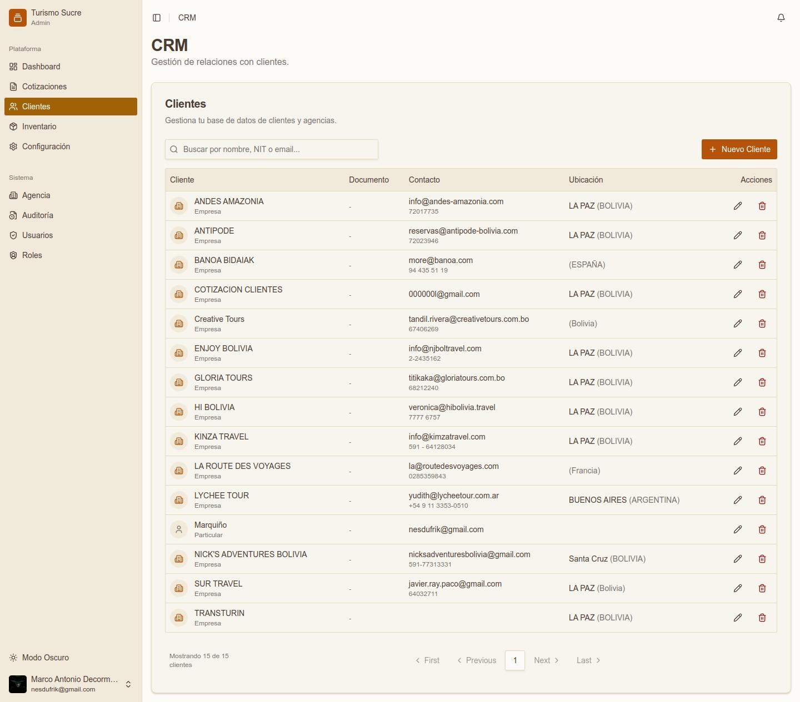
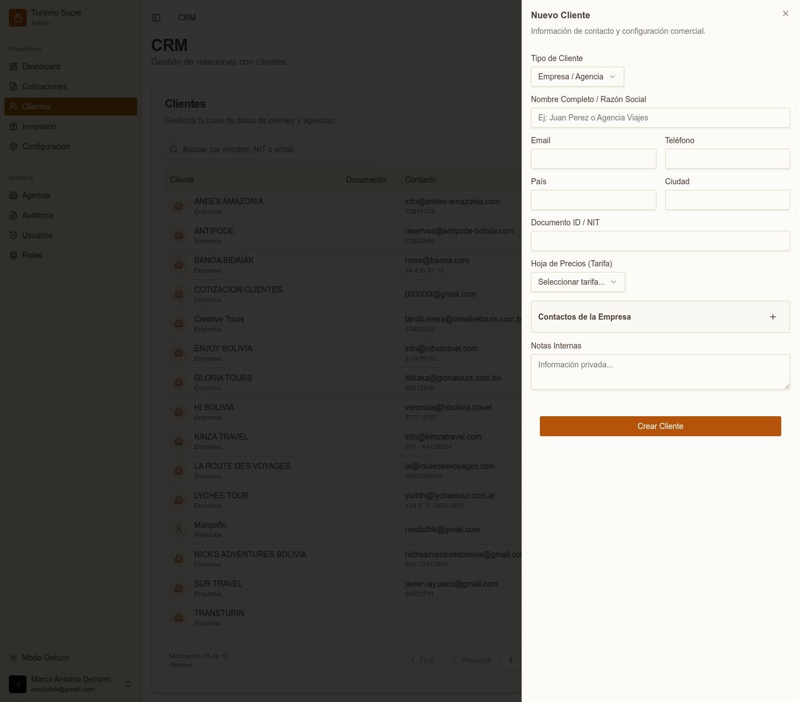
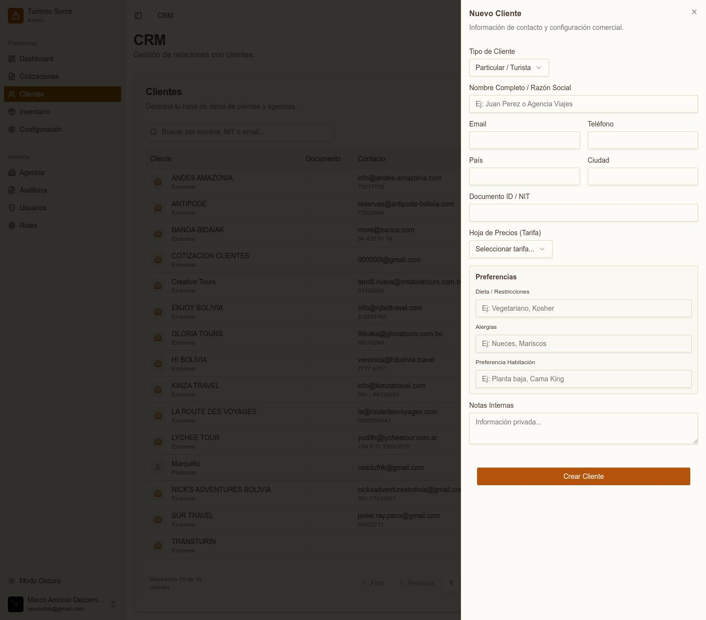

El módulo CRM centraliza la base de datos de todos los clientes y agencias con las que trabaja Turismo Sucre.

## Lista de Clientes

*Lista de clientes registrados en el CRM*

La pantalla muestra todos los clientes con: nombre e ícono de tipo, documento (NIT/CI), contacto (email y teléfono), ubicación (ciudad y país), y acciones (editar o eliminar). La barra de búsqueda permite filtrar por nombre, NIT o email.

## Crear Nuevo Cliente — Empresa / Agencia

*Formulario de nuevo cliente tipo Empresa / Agencia*

<table class="manual-table"><tr><td>

**Campo / Elemento**
</td><td>

**Descripción**
</td></tr><tr><td>

**Tipo de Cliente**
</td><td>

Empresa / Agencia o Particular / Turista.
</td></tr><tr><td>

**Nombre Completo / Razón Social**
</td><td>

Nombre del cliente o razón social de la empresa.
</td></tr><tr><td>

**Email / Teléfono**
</td><td>

Datos de contacto principal.
</td></tr><tr><td>

**País / Ciudad**
</td><td>

Ubicación geográfica del cliente.
</td></tr><tr><td>

**Documento ID / NIT**
</td><td>

Número de identificación o NIT de la empresa.
</td></tr><tr><td>

**Hoja de Precios (Tarifa)**
</td><td>

Tarifa diferenciada asignada a este cliente para sus cotizaciones.
</td></tr><tr><td>

**Contactos de la Empresa**
</td><td>

Sección expandible (+) para registrar múltiples personas de contacto.w
</td></tr><tr><td>

**Notas Internas**
</td><td>

Información privada visible solo para la agencia.
</td></tr></table>

## Crear Nuevo Cliente — Particular / Turista

Además de los campos comunes, el tipo Particular / Turista incluye la sección Preferencias:

*Formulario de nuevo cliente tipo Particular / Turista*

<table class="manual-table"><tr><td>

**Campo / Elemento**
</td><td>

**Descripción**
</td></tr><tr><td>

**Dieta / Restricciones**
</td><td>

Preferencias alimentarias del viajero (ej. Vegetariano, Kosher).
</td></tr><tr><td>

**Alergias**
</td><td>

Alergias conocidas (ej. Nueces, Mariscos).
</td></tr><tr><td>

**Preferencia Habitación**
</td><td>

Tipo de habitación preferido (ej. Planta baja, Cama King).
</td></tr></table>

:::note
Las preferencias del cliente particular quedan guardadas en su perfil para que el equipo de ventas las considere al armar cotizaciones personalizadas.
:::
