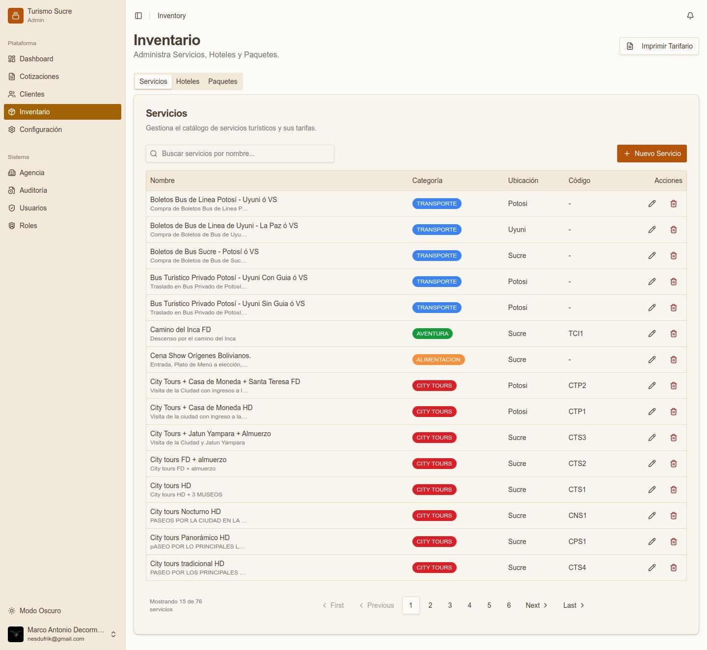
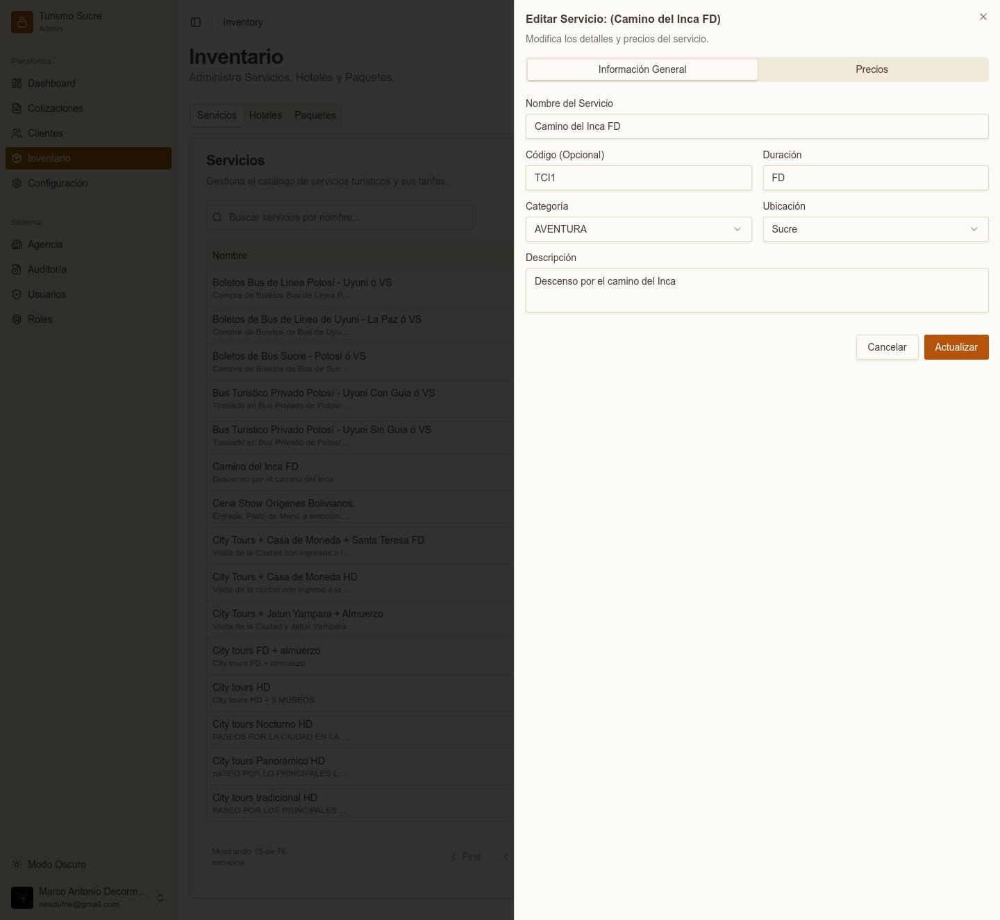
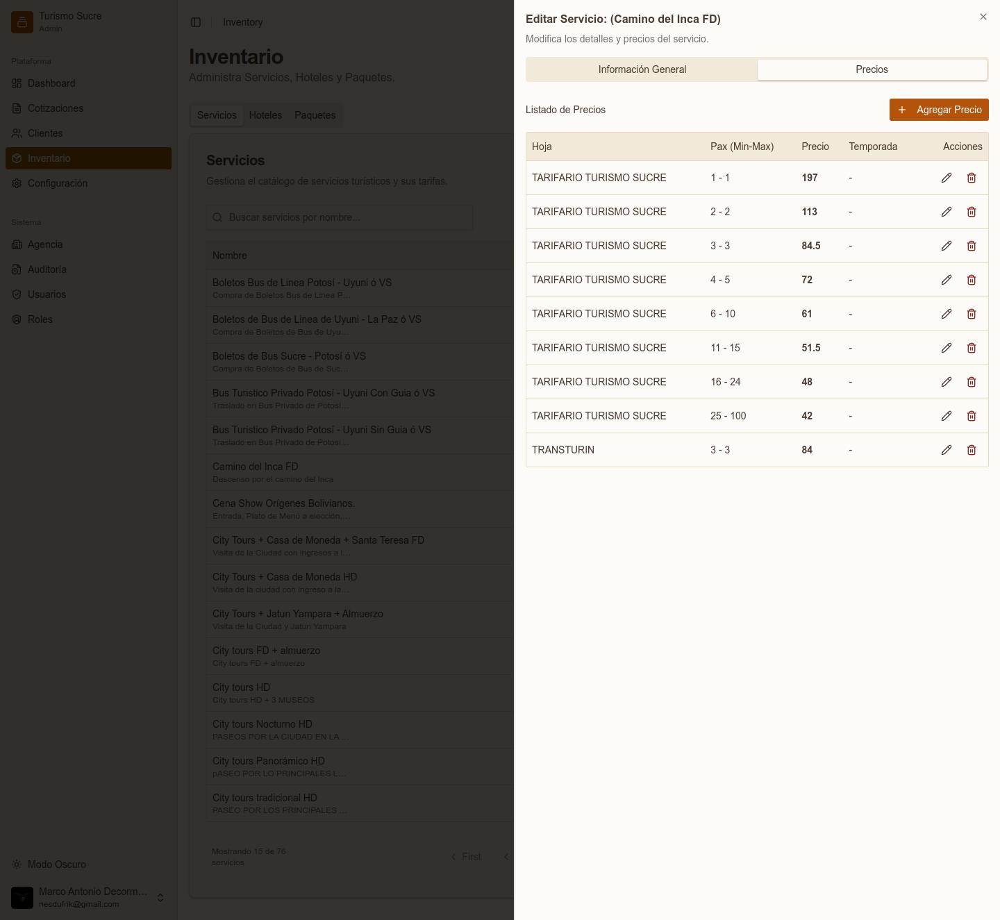
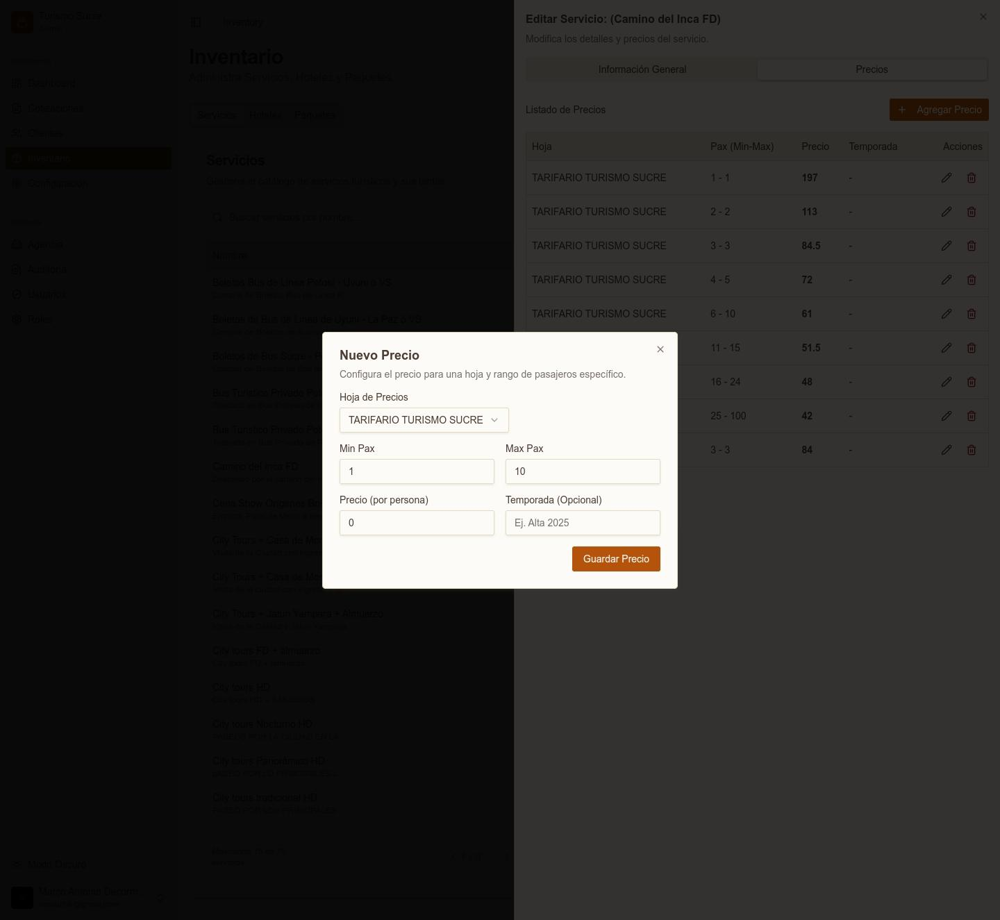
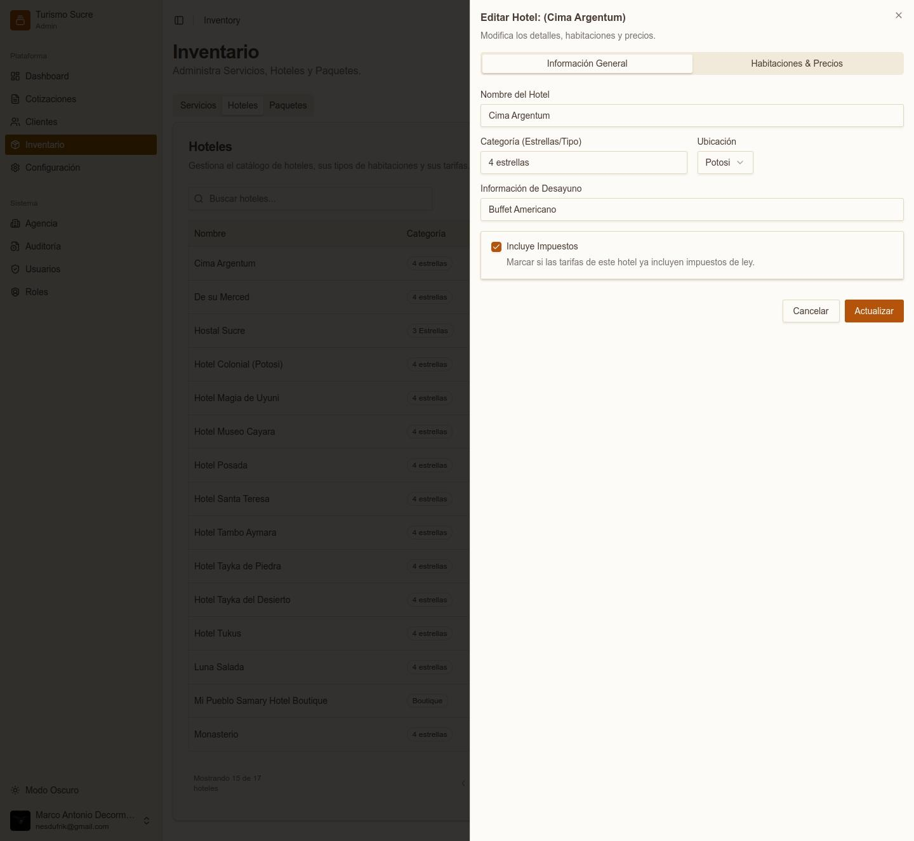
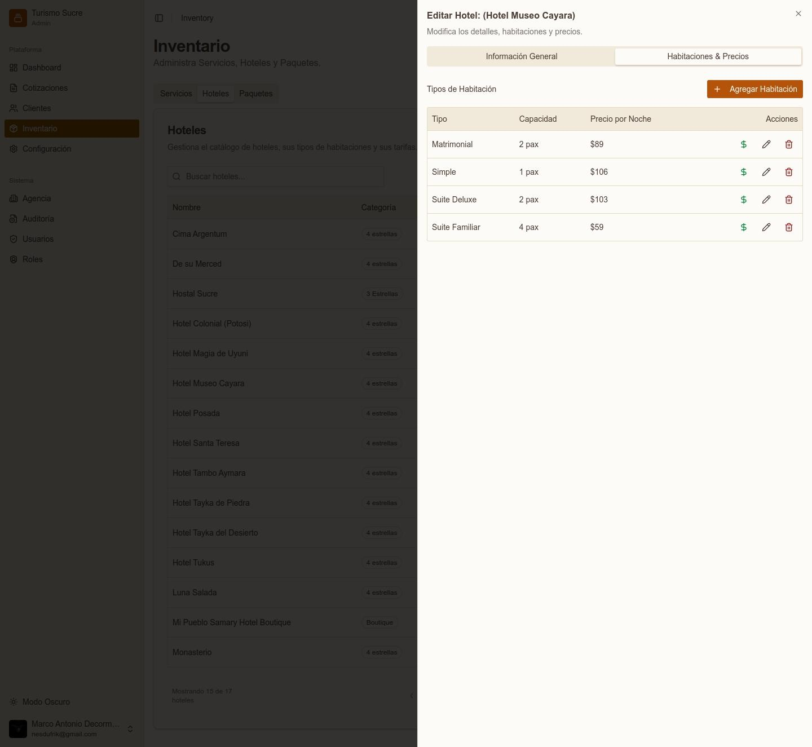
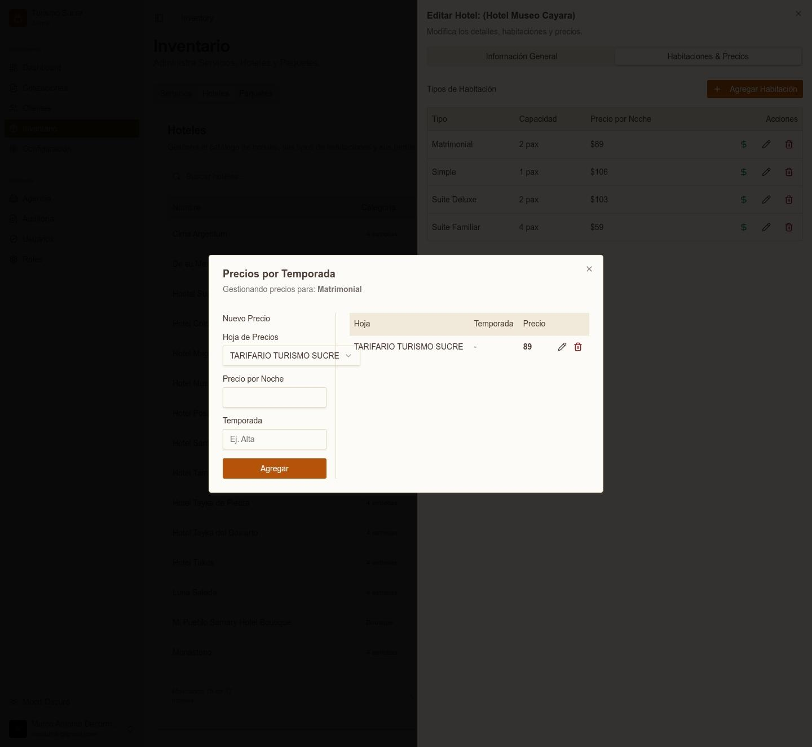

El módulo de Inventario gestiona el catálogo completo de productos turísticos organizados en tres categorías: Servicios, Hoteles y Paquetes. Desde la pantalla principal, el botón Imprimir Tarifario genera un documento con todos los precios.

## Servicios

*Inventario — lista de servicios turísticos*

La pestaña Servicios lista todos los servicios turísticos disponibles. Cada servicio muestra nombre, categoría (con color identificativo), ubicación y código. Use la barra de búsqueda para filtrar por nombre.

### Información General del Servicio

*Panel de edición de un servicio — pestaña Información General*
<table class="manual-table"><tr><td>

**Campo / Elemento**
</td><td>

**Descripción**
</td></tr><tr><td>

**Nombre del Servicio**
</td><td>

Nombre descriptivo del servicio.
</td></tr><tr><td>

**Código (Opcional)**
</td><td>

Código corto de referencia (ej. TCI1, CTS1).
</td></tr><tr><td>

**Duración**
</td><td>

HD = Medio Día, FD = Día Completo.
</td></tr><tr><td>

**Categoría**
</td><td>

Categoría del servicio (Transporte, City Tours, Aventura, etc.).
</td></tr><tr><td>

**Ubicación**
</td><td>

Ciudad donde se presta el servicio.
</td></tr><tr><td>

**Descripción**
</td><td>

Texto descriptivo para referencia interna del equipo.
</td></tr></table>

### Precios del Servicio

*Panel de precios del servicio — listado por rango de Pax*

La pestaña Precios muestra el listado de tarifas configuradas con columnas: Hoja de Precios, Pax (rango Min-Max), Precio por persona y Temporada.

Para agregar un nuevo precio, haga clic en + Agregar Precio:

*Formulario para agregar un nuevo precio*
<table class="manual-table"><tr><td>

**Campo / Elemento**
</td><td>

**Descripción**
</td></tr><tr><td>

**Hoja de Precios**
</td><td>

Seleccione la lista de precios a la que aplica esta tarifa.
</td></tr><tr><td>

**Min Pax / Max Pax**
</td><td>

Rango de pasajeros para este precio (ej. 4 a 5 personas).
</td></tr><tr><td>

**Precio (por persona)**
</td><td>

Precio unitario en la moneda base.
</td></tr><tr><td>

**Temporada (Opcional)**
</td><td>

Nombre de la temporada si varía (ej. Alta 2025).
</td></tr></table>

:::note
Los precios por rango permiten aplicar tarifas regresivas automáticas: a mayor número de pasajeros, menor precio por persona. El sistema selecciona automáticamente el rango correcto según el Nº Pax de la cotización.
:::

## Hoteles

*Panel de edición de hotel — Información General*
<table class="manual-table"><tr><td>

**Campo / Elemento**
</td><td>

**Descripción**
</td></tr><tr><td>

**Nombre del Hotel**
</td><td>

Nombre completo del establecimiento.
</td></tr><tr><td>

**Categoría (Estrellas/Tipo)**
</td><td>

Clasificación del hotel (ej. 4 estrellas, Boutique).
</td></tr><tr><td>

**Ubicación**
</td><td>

Ciudad donde se ubica el hotel.
</td></tr><tr><td>

**Información de Desayuno**
</td><td>

Tipo de desayuno incluido (ej. Buffet Americano).
</td></tr><tr><td>

**Incluye Impuestos**
</td><td>

Marcar si las tarifas ya incluyen impuestos de ley.
</td></tr></table>

### Habitaciones y Precios del Hotel

*Lista de tipos de habitación del hotel con precios*

La pestaña Habitaciones & Precios lista los tipos de habitación. Acciones disponibles:

<ul><li>+ Agregar Habitación: define el Tipo (ej. Simple, Matrimonial, Suite Deluxe) y la Capacidad en personas.</li><li>$ (ícono verde): abre el modal Precios por Temporada para gestionar tarifas por hoja de precios. Permite agregar Hoja de Precios, Precio por Noche y Temporada opcionales.</li><li>&#9999; (editar): modifica el tipo o capacidad de la habitación.</li><li>&#128465; (eliminar): elimina el tipo de habitación.</li></ul>

*Modal de precios por temporada para una habitación*
