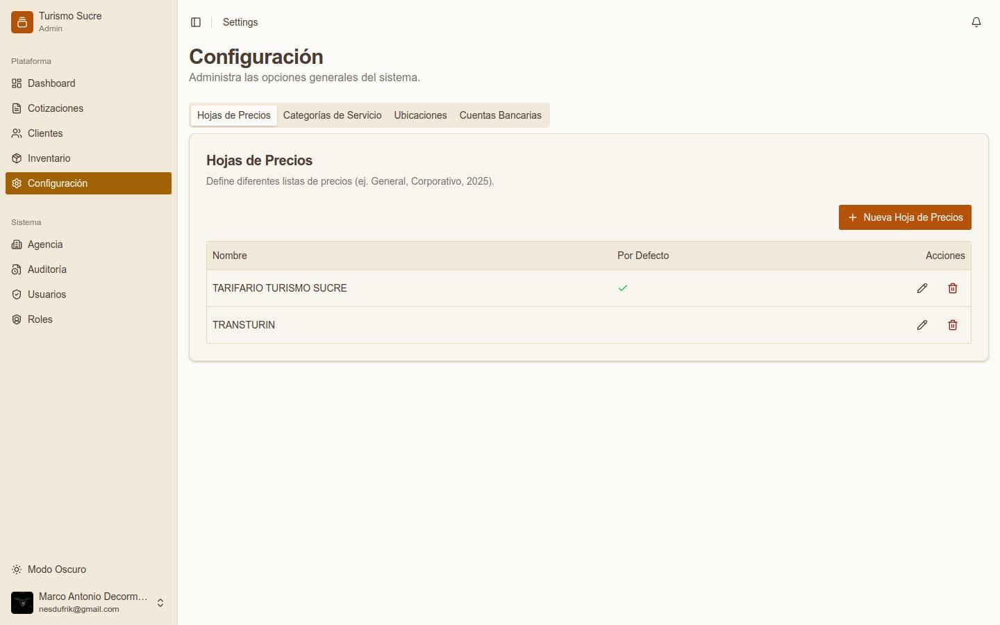
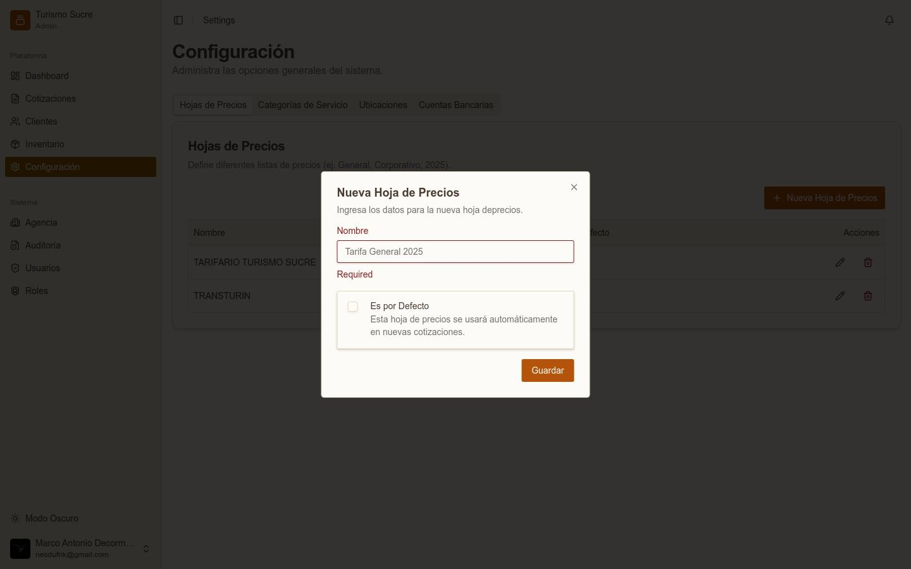
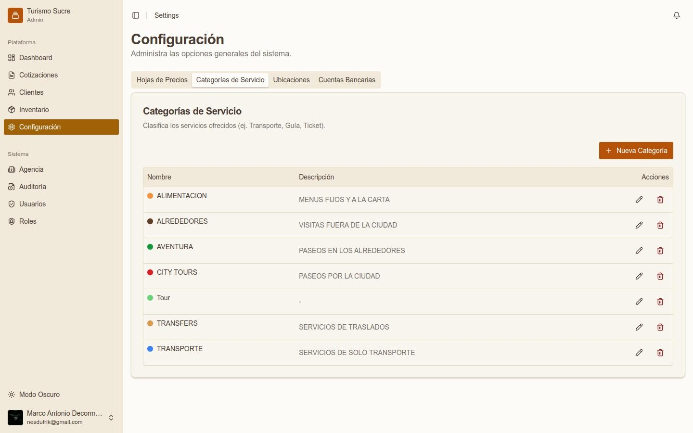
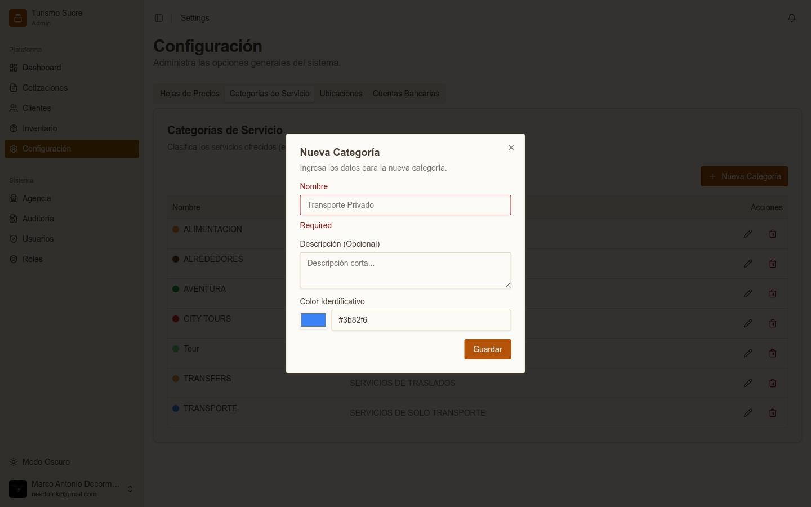
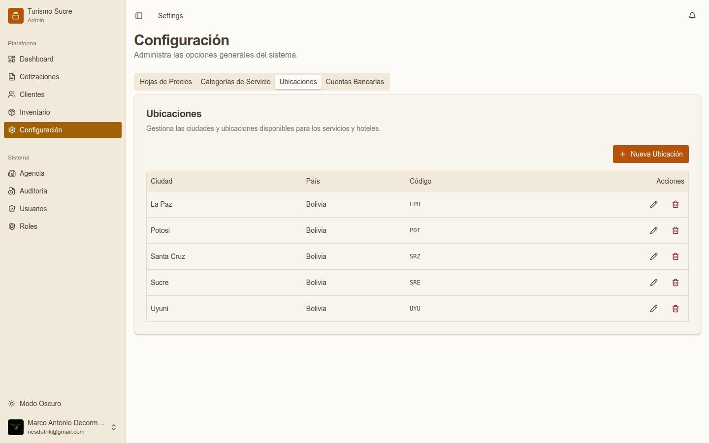
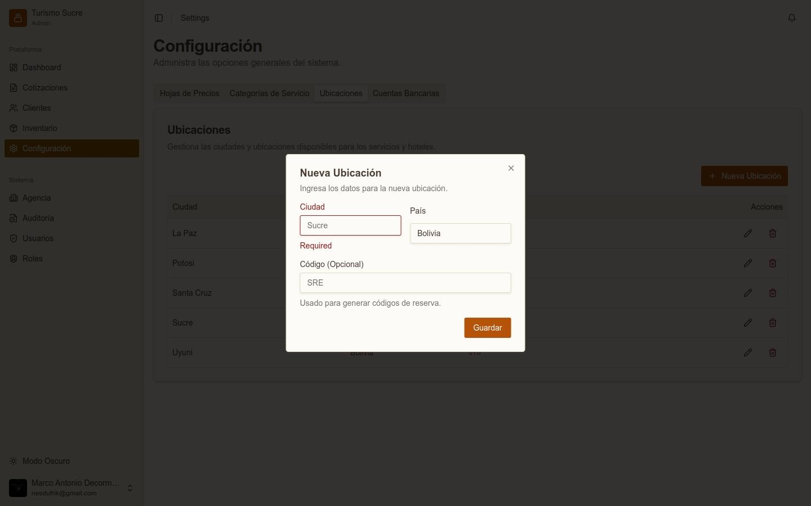
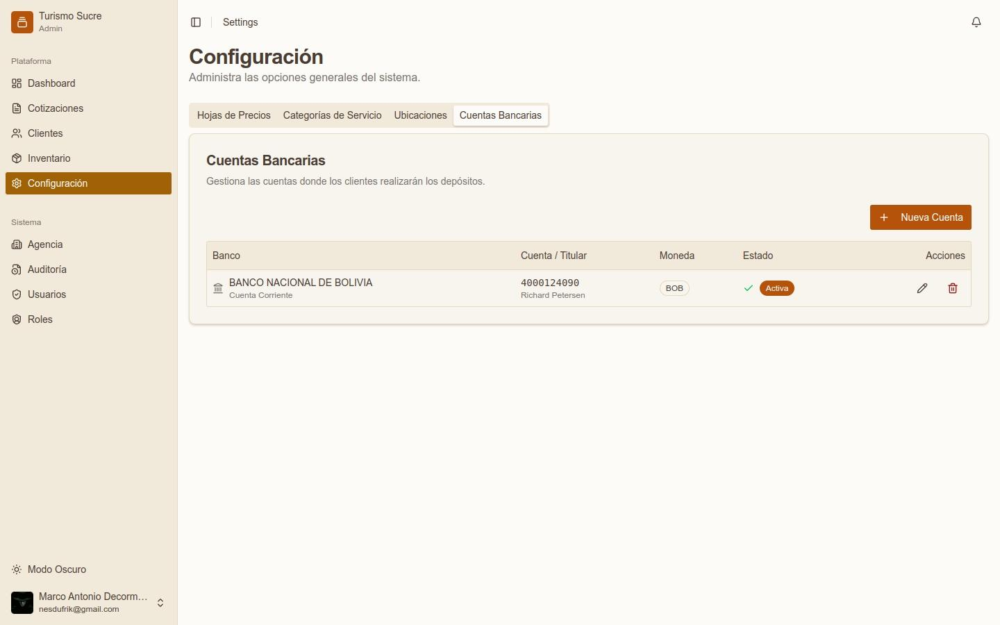
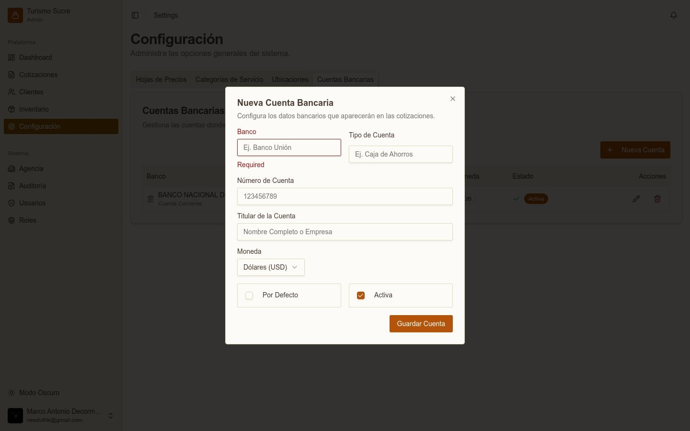

El módulo de Configuración agrupa los parámetros generales del sistema. Contiene cuatro pestañas.

:::note
Los usuarios con rol Agent u Operations solo pueden visualizar esta sección. Solo los administradores pueden crear, editar o eliminar registros de configuración.
:::

## Hojas de Precios

*Lista de hojas de precios configuradas*

*Formulario para crear una nueva hoja de precios*

Define las distintas listas de precios que se aplican a servicios y hoteles. Una cotización puede usar una hoja específica asignada al cliente.
<table class="manual-table"><tr><td>

**Campo / Elemento**
</td><td>

**Descripción**
</td></tr><tr><td>

**Nombre**
</td><td>

Nombre identificador de la tarifa (ej. Tarifario Turismo Sucre).
</td></tr><tr><td>

**Es por Defecto**
</td><td>

Si está marcada, esta hoja se usa automáticamente en nuevas cotizaciones.
</td></tr></table>

## Categorías de Servicio

*Lista de categorías de servicio*

*Formulario para crear una nueva categoría*

Clasifica los servicios del inventario. Cada categoría tiene un color identificativo visible en listas y cotizaciones.
<table class="manual-table"><tr><td>

**Campo / Elemento**
</td><td>

**Descripción**
</td></tr><tr><td>

**Nombre**
</td><td>

Nombre de la categoría. Campo obligatorio.
</td></tr><tr><td>

**Descripción (Opcional)**
</td><td>

Texto breve que describe el tipo de servicios.
</td></tr><tr><td>

**Color Identificativo**
</td><td>

Selector de color para distinguir visualmente la categoría.
</td></tr></table>

## Ubicaciones

*Lista de ubicaciones/ciudades configuradas*

*Formulario para agregar una nueva ubicación*

Gestiona las ciudades disponibles para asignar a servicios y hoteles del inventario.
<table class="manual-table"><tr><td>

**Campo / Elemento**
</td><td>

**Descripción**
</td></tr><tr><td>

**Ciudad**
</td><td>

Nombre de la ciudad. Campo obligatorio.
</td></tr><tr><td>

**País**
</td><td>

País al que pertenece la ciudad.
</td></tr><tr><td>

**Código (Opcional)**
</td><td>

Código corto para códigos de reserva (ej. SRE, LPB, UYU, POT).
</td></tr></table>

## Cuentas Bancarias

*Lista de cuentas bancarias configuradas*

*Formulario para agregar una nueva cuenta bancaria*

Administra las cuentas donde los clientes realizarán los depósitos. Estas cuentas aparecen en el selector de las cotizaciones.
<table class="manual-table"><tr><td>

**Campo / Elemento**
</td><td>

**Descripción**
</td></tr><tr><td>

**Banco**
</td><td>

Nombre del banco. Campo obligatorio.
</td></tr><tr><td>

**Tipo de Cuenta**
</td><td>

Tipo de cuenta (ej. Cuenta Corriente, Caja de Ahorros).
</td></tr><tr><td>

**Número de Cuenta**
</td><td>

Número de la cuenta bancaria.
</td></tr><tr><td>

**Titular de la Cuenta**
</td><td>

Nombre completo o razón social del titular.
</td></tr><tr><td>

**Moneda**
</td><td>

Moneda de la cuenta (USD, BOB, etc.).
</td></tr><tr><td>

**Por Defecto**
</td><td>

Si está marcada, esta cuenta aparece seleccionada por defecto en las cotizaciones.
</td></tr><tr><td>

**Activa**
</td><td>

Indica si la cuenta está habilitada para uso.
</td></tr></table>
