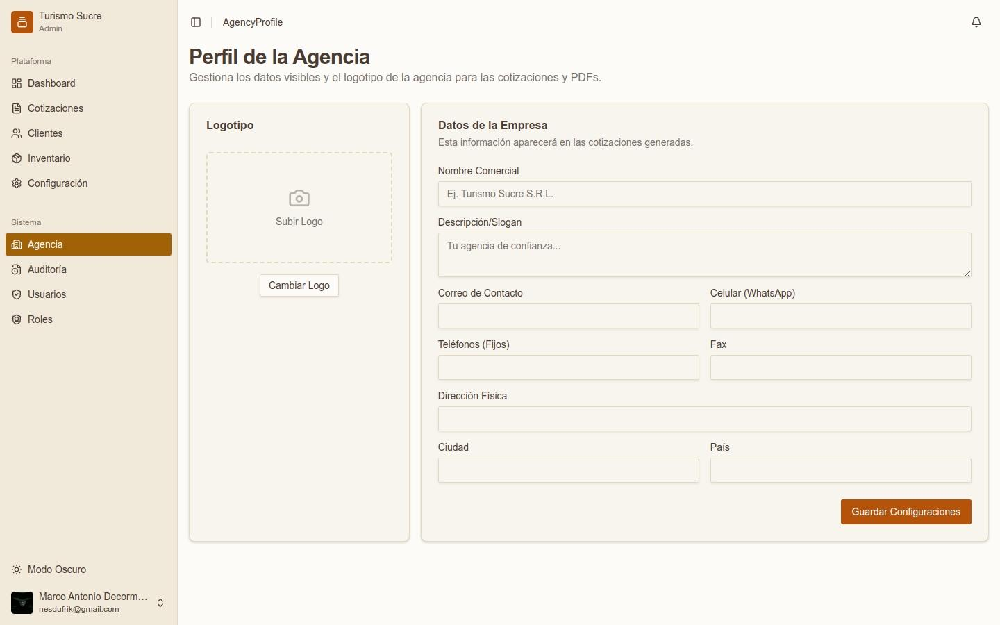
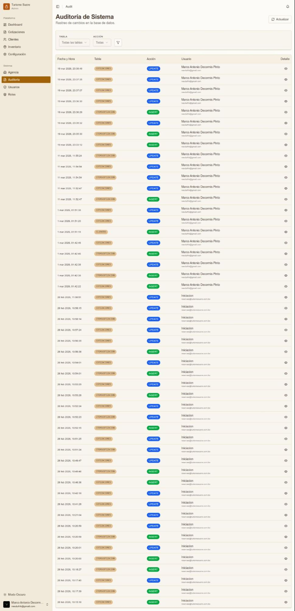
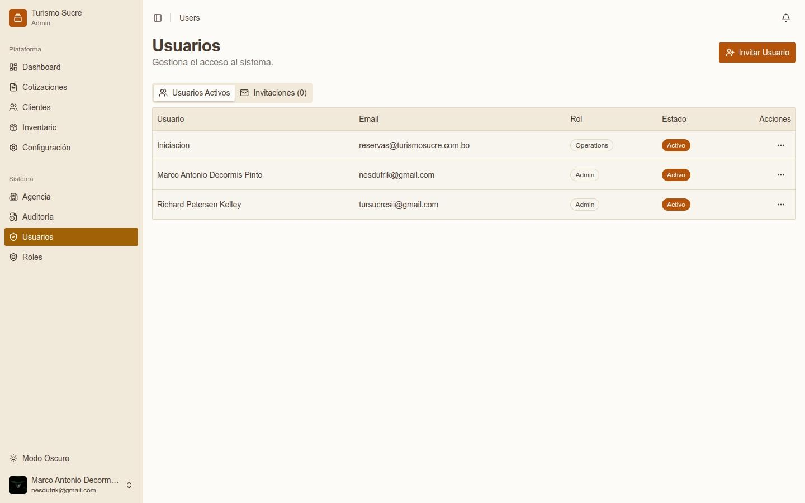
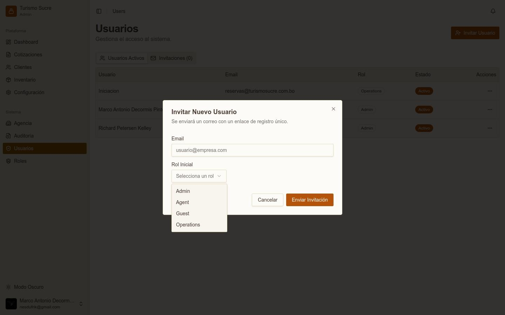
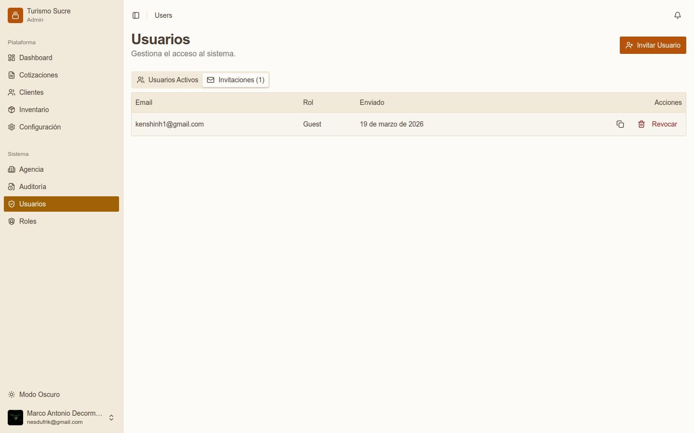
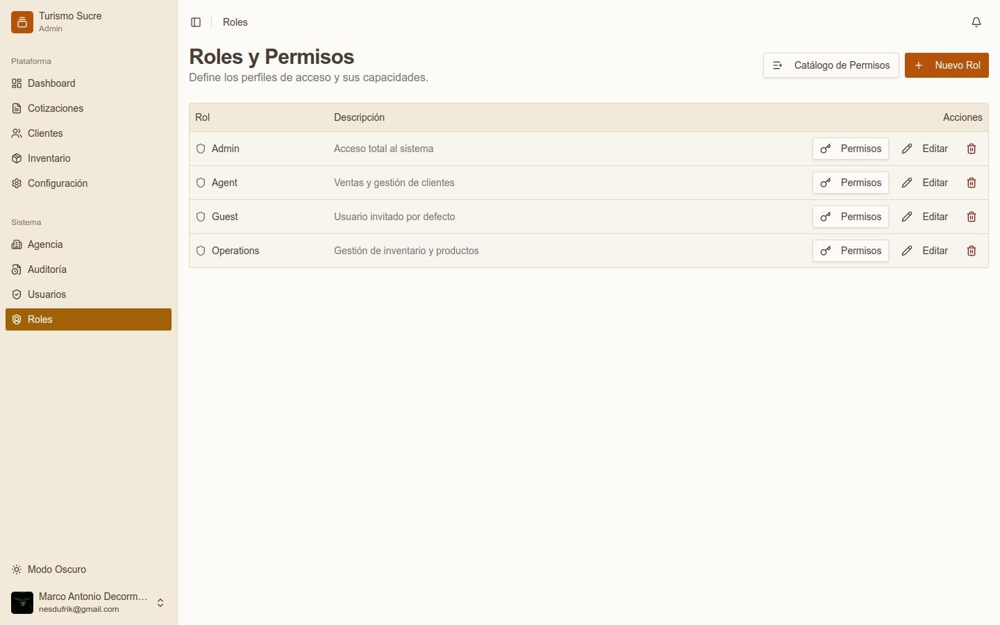
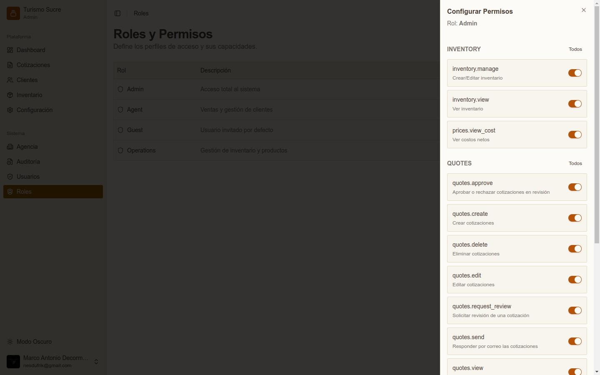
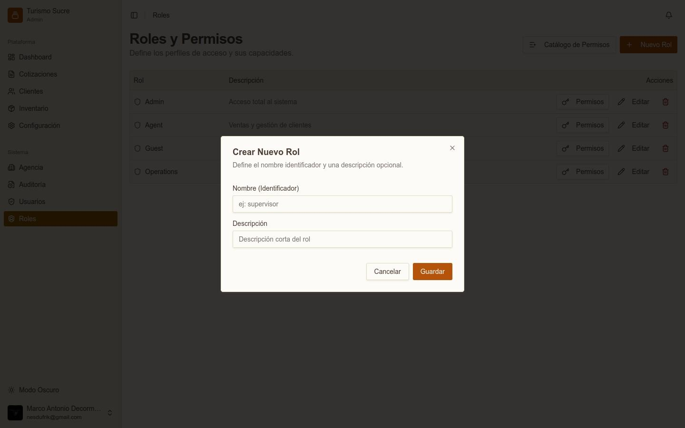

La sección Sistema agrupa las herramientas de administración interna. El acceso a cada módulo depende del rol del usuario.

## Perfil de la Agencia

*Módulo de configuración del perfil de la agencia*

Gestiona los datos visibles de la agencia que aparecen en cotizaciones y PDFs generados.

Panel Logotipo: haga clic en **Cambiar Logo** para subir la imagen del logotipo.
<table class="manual-table"><tr><td>

**Campo / Elemento**
</td><td>

**Descripción**
</td></tr><tr><td>

**Nombre Comercial**
</td><td>

Nombre que aparecerá en los documentos (ej. Turismo Sucre S.R.L.).
</td></tr><tr><td>

**Descripción/Slogan**
</td><td>

Texto breve bajo el nombre en los PDFs.
</td></tr><tr><td>

**Correo de Contacto**
</td><td>

Email de contacto de la agencia.
</td></tr><tr><td>

**Celular (WhatsApp)**
</td><td>

Número de WhatsApp para contacto.
</td></tr><tr><td>

**Teléfonos (Fijos) / Fax**
</td><td>

Teléfonos adicionales de la agencia.
</td></tr><tr><td>

**Dirección Física**
</td><td>

Dirección de la oficina.
</td></tr><tr><td>

**Ciudad / País**
</td><td>

Ubicación de la agencia.
</td></tr></table>

:::note
Haga clic en Guardar Configuraciones para aplicar los cambios. Esta información es crítica ya que aparece en todos los documentos generados para los clientes.
:::

## Auditoría del Sistema

*Registros de auditoría del sistema*

El módulo de Auditoría registra automáticamente todos los cambios realizados en la base de datos. Permite rastrear quién hizo qué acción y cuándo.
<table class="manual-table"><tr><td>

**Campo / Elemento**
</td><td>

**Descripción**
</td></tr><tr><td>

**Fecha y Hora**
</td><td>

Fecha y hora exacta del evento registrado.
</td></tr><tr><td>

**Tabla**
</td><td>

Módulo o entidad afectada (ej. COTIZACIONES, CLIENTES, ÍTEMS COTIZACIÓN).
</td></tr><tr><td>

**Acción**
</td><td>

Tipo de operación: INSERT (creación) o UPDATE (modificación).
</td></tr><tr><td>

**Usuario**
</td><td>

Nombre y email del usuario que realizó la acción.
</td></tr><tr><td>

**Detalle**
</td><td>

Ícono para ver el detalle completo del registro modificado.
</td></tr></table>

Use los selectores Tabla y Acción para filtrar los registros. El botón Actualizar recarga la lista.

## Usuarios

*Lista de usuarios activos en el sistema*

Gestiona el acceso al sistema. Solo usuarios con permiso users.manage pueden crear o modificar usuarios.

### Usuarios Activos

Lista a todos los miembros con acceso al sistema con: nombre, email, rol asignado y estado (Activo/Inactivo).

### Invitar Nuevo Usuario

*Modal para invitar un nuevo usuario al sistema*

<ol><li>Haga clic en Invitar Usuario.</li><li>Ingrese el Email del nuevo usuario.</li><li>Seleccione el Rol Inicial (Admin, Agent, Operations o Guest).</li><li>Haga clic en Enviar Invitación.</li></ol>

El sistema envía un correo con enlace de registro único. El usuario invitado debe seguirlo para completar su registro y definir su contraseña.

### Invitaciones Pendientes

*Lista de invitaciones pendientes de aceptación*

La pestaña Invitaciones muestra las invitaciones enviadas no aceptadas aún, con email, rol y fecha de envío. El botón Revocar cancela una invitación pendiente si es necesario.

## Roles y Permisos

*Lista de roles definidos en el sistema*

### Roles Predefinidos del Sistema

<table class="manual-table"><tr><td>

**Rol**
</td><td>

**Descripción**
</td><td>

**Perfil de Uso**
</td></tr><tr><td>

**Admin**
</td><td>

Acceso total al sistema
</td><td>

Administrador general. Sin restricciones.
</td></tr><tr><td>

**Agent**
</td><td>

Ventas y gestión de clientes
</td><td>

Personal de ventas que crea y gestiona cotizaciones.
</td></tr><tr><td>

**Operations**
</td><td>

Gestión de inventario
</td><td>

Personal operativo que administra el catálogo de servicios y hoteles.
</td></tr><tr><td>

**Guest**
</td><td>

Usuario invitado
</td><td>

Acceso de solo lectura. Rol asignado por defecto al invitar.
</td></tr></table>

### Matriz de Acceso por Módulo y Rol

La siguiente tabla resume las capacidades de cada rol en cada módulo del sistema:
<table class="manual-table"><tr><td>

**Módulo / Acción**
</td><td>

**Admin**
</td><td>

**Agent**
</td><td>

**Operations**
</td><td>

**Guest**
</td></tr><tr><td>

**Dashboard**
</td><td>

**✓ Total**
</td><td>

**✓ Total**
</td><td>

**✓ Total**
</td><td>

**✓ Total**
</td></tr><tr><td>

**Cotizaciones — Ver**
</td><td>

**✓ Total**
</td><td>

Solo las propias
</td><td>

**✓ Total**
</td><td>

Solo visualizar
</td></tr><tr><td>

**Cotizaciones — Crear**
</td><td>

**✓ Total**
</td><td>

✓ Crear
</td><td>

**✓ Total**
</td><td>

✗ Sin acceso
</td></tr><tr><td>

**Cotizaciones — Editar**
</td><td>

**✓ Total**
</td><td>

Solo en Borrador
</td><td>

**✓ Total**
</td><td>

✗ Sin acceso
</td></tr><tr><td>

**Cotizaciones — Eliminar**
</td><td>

**✓ Total**
</td><td>

Solo las propias
</td><td>

**✓ Total**
</td><td>

✗ Sin acceso
</td></tr><tr><td>

**Cotizaciones — Aprobar**
</td><td>

**✓ Total**
</td><td>

✗ Sin acceso
</td><td>

**✓ Total**
</td><td>

✗ Sin acceso
</td></tr><tr><td>

**Cotizaciones — Responder**
</td><td>

**✓ Total**
</td><td>

✗ Sin acceso
</td><td>

**✓ Total**
</td><td>

✗ Sin acceso
</td></tr><tr><td>

**Cotizaciones — Ver totales**
</td><td>

**✓ Total**
</td><td>

✗ Sin acceso
</td><td>

**✓ Total**
</td><td>

✗ Sin acceso
</td></tr><tr><td>

**Cotizaciones — PDF**
</td><td>

**✓ Total**
</td><td>

✓ Permitido
</td><td>

**✓ Total**
</td><td>

Solo visualizar
</td></tr><tr><td>

**Clientes (CRM) — Ver**
</td><td>

**✓ Total**
</td><td>

**✓ Total**
</td><td>

**✓ Total**
</td><td>

Solo visualizar
</td></tr><tr><td>

**Clientes (CRM) — Crear/Editar**
</td><td>

**✓ Total**
</td><td>

**✓ Total**
</td><td>

**✓ Total**
</td><td>

✗ Sin acceso
</td></tr><tr><td>

**Inventario — Ver**
</td><td>

**✓ Total**
</td><td>

Solo visualizar
</td><td>

**✓ Total**
</td><td>

Solo visualizar
</td></tr><tr><td>

**Inventario — Gestionar**
</td><td>

**✓ Total**
</td><td>

✗ Sin acceso
</td><td>

**✓ Total**
</td><td>

✗ Sin acceso
</td></tr><tr><td>

**Configuración**
</td><td>

**✓ Total**
</td><td>

Solo visualizar
</td><td>

Solo visualizar
</td><td>

✗ Sin acceso
</td></tr><tr><td>

**Sistema — Agencia**
</td><td>

**✓ Total**
</td><td>

Solo visualizar
</td><td>

Solo visualizar
</td><td>

✗ Sin acceso
</td></tr><tr><td>

**Sistema — Auditoría**
</td><td>

**✓ Total**
</td><td>

✗ Sin acceso
</td><td>

Solo visualizar
</td><td>

✗ Sin acceso
</td></tr><tr><td>

**Sistema — Usuarios**
</td><td>

**✓ Total**
</td><td>

✗ Sin acceso
</td><td>

✗ Sin acceso
</td><td>

✗ Sin acceso
</td></tr><tr><td>

**Sistema — Roles**
</td><td>

**✓ Total**
</td><td>

✗ Sin acceso
</td><td>

✗ Sin acceso
</td><td>

✗ Sin acceso
</td></tr></table>

### Configurar Permisos de un Rol

*Panel de configuración de permisos del rol Admin*

Para modificar los permisos de un rol:

<ol><li>En Roles y Permisos, haga clic en el botón **Permisos** del rol a configurar.</li><li>Se abre un panel lateral con todos los permisos organizados por módulo (INVENTORY, QUOTES, SETTINGS, USERS).</li><li>Active o desactive cada permiso con los interruptores (toggle).</li><li>Use el botón Todos junto a cada módulo para activar/desactivar todos los permisos del grupo a la vez.</li><li>Haga clic en Guardar Permisos para confirmar los cambios.</li></ol>

### Catálogo Completo de Permisos

<table class="manual-table"><tr><td>

**Módulo**
</td><td>

**Permiso**
</td><td>

**Descripción**
</td></tr><tr><td>

**INVENTORY**
</td><td>

inventory.manage
</td><td>

Crear y editar inventario de servicios y hoteles
</td></tr><tr><td>

**INVENTORY**
</td><td>

inventory.view
</td><td>

Ver inventario
</td></tr><tr><td>

**INVENTORY**
</td><td>

prices.view_cost
</td><td>

Ver costos netos de servicios en cotizaciones
</td></tr><tr><td>

**QUOTES**
</td><td>

quotes.approve
</td><td>

Aprobar o rechazar cotizaciones en revisión
</td></tr><tr><td>

**QUOTES**
</td><td>

quotes.create
</td><td>

Crear nuevas cotizaciones
</td></tr><tr><td>

**QUOTES**
</td><td>

quotes.delete
</td><td>

Eliminar cotizaciones
</td></tr><tr><td>

**QUOTES**
</td><td>

quotes.edit
</td><td>

Editar cotizaciones existentes
</td></tr><tr><td>

**QUOTES**
</td><td>

quotes.request_review
</td><td>

Enviar cotización a revisión
</td></tr><tr><td>

**QUOTES**
</td><td>

quotes.send
</td><td>

Responder y enviar cotizaciones por correo al cliente
</td></tr><tr><td>

**QUOTES**
</td><td>

quotes.view
</td><td>

Ver cotizaciones del sistema
</td></tr><tr><td>

**SETTINGS**
</td><td>

audit.view
</td><td>

Ver registros de auditoría del sistema
</td></tr><tr><td>

**USERS**
</td><td>

users.manage
</td><td>

Crear, editar e invitar usuarios
</td></tr><tr><td>

**USERS**
</td><td>

users.view
</td><td>

Ver lista de usuarios activos
</td></tr></table>

### Crear un Nuevo Rol

*Modal para crear un nuevo rol personalizado*

Para crear un rol personalizado, haga clic en + Nuevo Rol. Ingrese el Nombre (identificador único) y una Descripción opcional. Después de crearlo, configure sus permisos con el botón Permisos.

:::note
El nombre del rol es un identificador único en el sistema. Se recomienda usar nombres descriptivos en inglés y sin espacios (ej. &#39;supervisor&#39;, &#39;accounting&#39;).
:::
